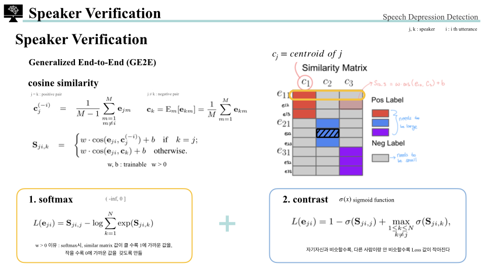

> [Generalized End-to-End Loss for Speaker Verification](https://arxiv.org/pdf/1710.10467.pdf)  

# 1. Introduction

- Generalized End-to-End Loss(GE2E)는 발화자 식별(speaker verification)을 위해 제안된 손실 함수 
  

# 2. Method
## 2.2 Loss 

- 각 batch는 $N \times M$ 개의 utterance로 구성 
  각 M개의 utterance로 구성된 N명의 발화자 (ex) 위 그림에는 N = 3, M = 3 
- <b>$x_{ji}$: j speaker의 i번 째 feature vector x</b>
- 각 $x_{ji}$ input들은 LSTM 네트워크를 거치고, 마지막 frame을 추가적인 linear layer를 통하여 embedding 진행. embedding output은 $f(x_{ji}; w)$로, $w$ 파라미터를 가진 전체 네트워크의 embedding vector 의미
- embedding vector는 L2 normalization을 사용하여 최종 output 값으로 사용
  $$e_{ji}=\frac{f(x_{ji};w)}{\Vert f(x_{ji};w) \Vert_2}$$
- j번 째 speaker의 embedding vector들의 <b>centroid embedding vector</b>들은 $c_j$로, 아래의 수식을 사용하여 구함
  $$c_j=E_m[e_{jm}]=\frac{1}{M}\sum_{m=1}^M e_{jm}$$
  - $[e_{ji}, \cdots, e_{jM}]$: j번 째 speaker의 M 개의 embedding vectors
  

- 각 embedding vector들과 각 speaker의 centroid embedding vector들의 cosine similarity를 계산하고 scaling하여 <b>similarity matrix $S_{ji,k}$</b>를 만듦
  $$S_{ji,k}=w\cdot cos(e_{ji, c_k})+b$$
  - $w,\; b$: learnable parameters
  - $w > 0$: cosine similarity가 커질 때, similarity도 동일하게 커지게 하기 위함
- 이전 이미지의 similarity matrix에서 색칠된 embedding vector들은 해당하는 centroid와는 가깝게, 해당하지 않는 centroids와는 거리가 멀도록 해야함
- 위 이미지에서의 파란색 동그라미가 파란색 삼각형과 가까워져야하며, 다른 색상의 삼각형과는 멀어져야함. 특히 상대적으로 가까운 빨간색 삼각형과 거리를 벌려야함 $\rightarrow$ <b>Softmax & Contrast term 사용</b>
1. Softmax
  - similarity matrix를 softmax 함수를 사용하여 output이 k == j일 때 1이, k !=
j일 때 0이 나오게 할 수 있도록 함
  $$L(e_{ji})=-S_{ji,j}+log\sum_{k=1}^N exp(S_{ji,k})$$
  - 해당하는 centroid와 가깝게, 다른 모든 centroid와 멀게 embedding vector 위치시킴
2. Contrast
  $$L(e_{ji})=1-\sigma(S_{ji,j})+max_{1\leq k \leq N,\; k\neq j}\;\sigma(S_{ji,k})$$
  - $\sigma(s)$: sigmoid function
  - 모든 utterance에 2가지 요소가 loss에 더해짐 
    (1) positive component: 해당하는 speaker의 voiceprint(centroid)와 비교 
    (2)negative component: 다른 모든 speaker 중에 가장 비슷한 speaker의 voiceprint(centroid)와 비교 (hard negative component)
  

- 학습의 안정성을 높이고 자명성(trivial)을 피하기 위해 $e_{ji}$를 제외하고 해당하는 발화자의 centroid를 구하는 것이 좋기에 수식 변경하여 사용
  $$c_j^{(-i)}=\frac{1}{M-1}\sum^M_{m=1,\ m\neq i}e_{jm}$$
  $$S_{ji,k}=\begin{cases}
      w\cdot cos(e_{ji}, c_j^{(-i)}) + b, & \text{if}\ k=j \\
       w\cdot cos(e_{ji}, c_k) + b, & \text{otherwise}
    \end{cases}$$
- 최종 loss function은 아래와 같이 표현
  $$L_G(x; w)=L_G(S)=\sum_{j,i}L(e_{ji})$$
  

## 2.2. Training with MultiReader
- 작은 데이터셋 $D_1$과 도메인이 비슷하지만 동일하지 않은 큰 데이터셋 $D_2$ 존재
- $D_2$의 보조로 $D_1$을 잘 학습하기 위한 방법 ($D_1$ overfitting 방지)
  $$L(D_1,D_2;w)=E_{x\in D_1}[L(x;w)]+\alpha \ E_{x\in D_2}[L(x;w)]$$
- regularization과 비슷한 방식
  - regularization은 $\alpha\Vert w\Vert_2^2$를 사용
  - 제안된 방법은 $\alpha \ E_{x\in D_2}[L(x;w)]$를 regularization으로 사용
- K개의 다른 데이터셋 사용도 가능
  $$L(D_1,\cdots,D_K;w)=\sum_{k=1}^K \alpha_k \ E_{x_k\in D_k}[L(x_k;w)]$$

# 3. Text-Independent Speaker Verification Result

- input: 40-dimension log-mel-filterbank energies (width 25ms, step 10ms)
- Voice Activity Detection(VAD) 이후에 utterance를 더 작은 segment로 나눠서 partical utterance를 만듦
- training: 같은 batch에는 같은 길이의 partial utterances로 구성 ($140 \leq t \leq 180$ frames)
  

- inference: sliding 160 frames 길이의 sliding window를 50%씩 겹쳐서 각각 embedding vector를 구하고 이를 window-wise L2 normalize한 후, element-wise 평균을 해주어서 에서 input으로 사용
- EER(Equal Error Rate)가 GE2E가 TE2E보다 10% 개선되었고, 다른 loss function보다 3배 빠르게 학습됨
- <b>TE2E(Tuple-Based End-to-End Loss)</b>
  - GE2E 이전 버전, FaceNet의 triplet loss와 유사한 방식
  - 평가할 1개의 utterance $x_{j\sim}$와 등록할 M개의 utterance $x_{km}\; (\text{for} \; m=1,\cdots,M)$를 LSTM network의 입력값으로 사용
    - $\{x_{j\sim},\; (x_{k1, \cdots, x_{kM}})\}$
    - x: fixed length log-mel-filterbank energies
    - j, k: speakers, j와 k는 동일한 사람일 수도 다른 사람일 수 있음
    - j == k: positive tuple $\qquad$ j != k: negative tuple
  - LSTM의 L2 normalize된 값 $\{e_{j\sim},\;(e_{k1}, \cdots, e_{kM})\}$에서 k speaker의 centroid를 아래 수식으로 구함
    $$c_k=E_m[e_{km}]=\frac{1}{M}\sum_{m=1}^M e_{km}$$
  - learnable parameter인 $w, \; b$를 사용하여 simliarity 계산
    $$s=w\cdot cos(e_{j\sim}, c_k)+b$$
  - 최종 TE2E loss
    $$L_T(e_{j\sim},c_k)=\delta(j,k)(1-\sigma(s))+(1-\delta(j,k))\sigma(s)$$
    - $\sigma(s)$: sigmoid function
    - $\delta(j,k)$: j == k면 1, 아니면 0
    - j == k이면 s 값이 커지고, j != k이면 s 값이 작아지도록 만듦 
  - GE2E와 다른 점
    - TE2E는 $e_{j\sim}$와 <b>하나의 tuple centroid</b> $c_k$와의 similarity 비교
    - GE2E는 각 $e_{ji}$와 <b>모든 centroids</b> $c_k$와 similarity 비교
  

- EER(Equal Error Rate) 설명에 대한 이미지

