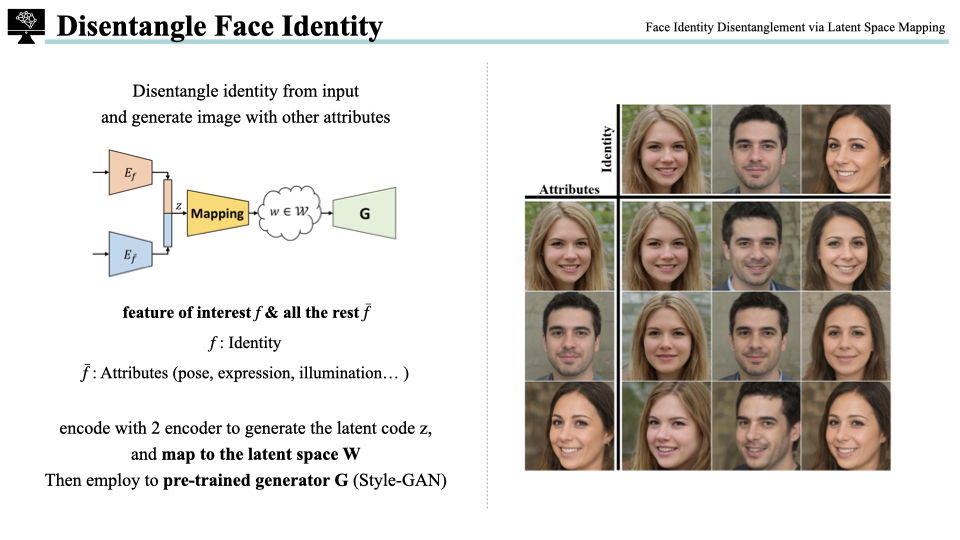

논문: [Face Identity Disentanglement via Latent Space Mapping](https://arxiv.org/abs/2005.07728)   

 

 

# Disentangle Face Identity

 

- face id disentanglement: 입력 이미지에서 identity와 attribute 분리 (disentangle)
- 좌측 표: 사람의 identity와 얼굴 방향, 조명, 표정 등의 attribute를 분리하고 합칠 
수 있음
- identity $f$와 attribute $\bar{f}$를 각각의 encoder에 넣고 output을 concat해서 latent code $z$ 생성
- $z$를 latent space $W$에 mapping
- pre-trained된 StyleGAN의 generator $G$를 활용하여 이미지 생성
  

 

- Mapping의 학습 목표: 각 부분에서의 relevant한 정보를 분리(disentanglement)하고 추출(extract)하기 
    pre-trained StyleGAN을 사용하기에 이미지 생성 task와 분리되어 학습 가능
- StyleGAN은 AdaIN 방식을 활용하여 style transfer 
    noise를 더하여 stochastic variation 추가 (ex) 머리카락, 주름, ...
  

# Network & Dataset

 

- network flowchart
- 2개의 input image
    - face identity input: ${I}_{id}$ 
    - attribute input: $I_{attr}$
  

 

- 각가의 input 이미지를 서로 다른 encoder를 사용하여 latent vector 생성
    - latent vector는 classification을 위한 fully-connected(linear) layer 이전의 output 값 사용 
- $E_{id}$ Encoder
    - input: $I_{id}$ 이미지
    - encoder
        - ResNet-50 face recognition model
        - pretrained with VGGFace2 dataset
        - weights frozen
- $E_{attr}$ Encoder
    - input: $I_{attr}$ 이미지
    - encoder
        - Inception V3
        - trainable
  

 

- $M (mapping)$
    - input: latent vector $z$
    - encoder
        - 4 liner layers with Leaky ReLU
        - trainable
    - latent vector $z$가 StyleGAN latent space에 있을 수 있도록 mapping
- G (StyleGAN)
    - generator
        - pretrained with FFHQ dataset (image size - 512 $\times$ 512)
        - 이 논문에서는 256 $\times$ 256 sized pretrained StyleGAN 사용
        - weights frozen
  

 

- StyleGAN으로 training dataset을 생성 
   70,000개의 random Gaussian noise를 SytleGAN으로 넣어주어 vector $w$와 output image를 Discriminator의 "real" sample로 사용
  

# Loss

 

- loss는 크게 adversarial과 non-adversarial로 나뉨
- 우측 하단 flowchart의 빨간색 상자 부분만 adversarial loss
- non-adversarial loss는 총 3가지 loss로 구성
  

## Adversarial loss

 

- 실제 이미지처럼 만들기 위한 loss
- $w$는 real sample, $z$는 latent code
- $\mathcal{L}_{adv}^D$: Discriminator loss
    - $-\mathbb{E}_{w\sim \mathcal{W}}[log\ D_{\mathcal{W}(w)}]$:  
    real sample w는 1에 가깝도록 학습 (log 1 = 0)
    -  $-\mathbb{E}_{z}[log(1-D_{\mathcal{W}}M(z))]$:   
    latent space W로 mapping한 값은 M(z)로 generated data로 discriminator는 0에 가까운 값으로 예측하도록 학습
    - $\frac{\lambda}{2} \mathbb{E}_{w\sim \mathcal{W}} [\Vert \nabla_w D_{\mathcal{W}}(w) \Vert^2_2]$:   
    non-saturating loss with R1 refualrization
- $\mathcal{L}_{adv}^G$: Generator loss
    - generated된 data가 real sample과 구분할 수 없어야 함
  

## Non-Adversarical loss

 

- $\mathcal{L}_{id}$: ID consistency
    - input id 이미지와 생성된 output 이미지가 $E_{id}$ encoder를 통과했을 때, 이 둘의 identity vector가 일치해야함 (L1 distance)
- $\mathcal{L}_{lnd}$: landmark consistency
    - landmark는 얼굴 key point (52 points)
    - pre-trained된 landmark network 사용 (frozen network)
    - 얼굴 모양에 영향을 주는 턱 라인 제거하여 사용
    - input attribute 이미지와 output 이미지의 얼굴 landmark가 동일한지 비교
  

 

- $\mathcal{L}_{rec}$: pixel reconstruction loss
    - multi-scale SSIM & L1 loss 사용
    - id 이미지와 attribute 이미지가 동일할 때만 사용
    - SSIM은 인지(perception) 기반의 loss. luminance, contrast 그리고 structural한 왜곡 확인
    - MS-SSIM은 low-pass filtering하고 down-sampling해서 여러 resolution에서 SSIM을 구하는 방법
    - L1은 색생 보정(color correction)하기 위해 사용
  

# Ablation Study

 

- ablation study에서는 adversarial loss와 landmark loss 유무의 차이 비교
- discriminator와 adversarial loss의 유무
    - discriminator $D_w$는 mapping network $M$이 latent representation을 StyleGAN의 $\mathcal{W}$ space로 mapping이 되도록 함
    - 좌측: $D_w$를 사용하지 않았을 때(빨간색)보다 $D_w$를 사용했을 때(하늘색)가 StyleGAN $\mathcal{W}$의 영역(초록색)에 더 잘 mapping 됨을 보임
    - 우측: 생성된 이미지들도 $D_w$를 사용할 때, 더 좋은 퀄리티를 보임
- landmark loss의 유무
    - landmark loss는 disentanglement에 필수적인 요소는 아니지만, attribute를 보존하는 역할 수행
    - landmark loss를 사용할 때, expression과 pose의 성능이 향상됨
  

# Results

 

- 3개의 데이터셋을 사용해서 생성한 결과
  

 

- 좌측: 기존 얼굴 바꾸는 방법(face swapping)들과의 비교
- 우측: 기존 reconstruction network들과의 비교
    - reconstruction이 목표가 아니었음에도 잘 되고 있음을 보임
  

# Application

 

- $W$와 $Z$ feature space에서 interpolation하기
- StyleGAN $W$ feature space에서 interpolation
    - StyleGAN에서 interpolation이 가능한 것처럼 논문의 방식도 interpolation이 가능함
- $Z$ feature space에서 interpolation
    - identification과 attribute가 disentangled됨을 보임
  

 

- 동영상에서도 가능함을 보임