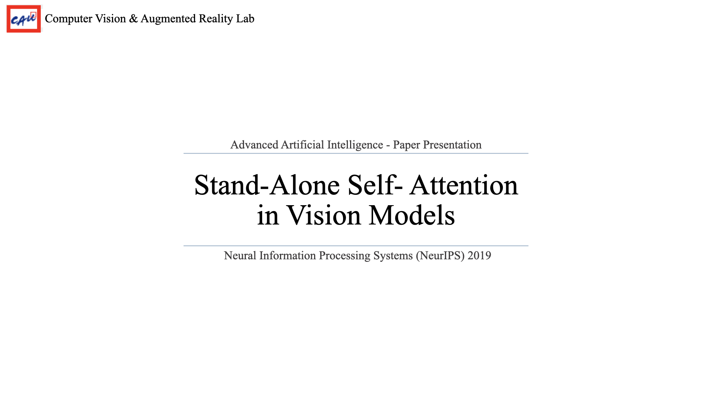

논문: [Stand-Alone Self-Attention in Vision Models](https:/proceedings.neurips.cc/paper_files/paper/2019/file/3416a75f4cea9109507cacd8e2f2aefc-Paper.pdf)   

 

 

# Introduction

 

- CNN은 image recognition, object detection, image segmentation에서 좋은 성능을 보임
    - 이유: CNN kernel/weigth 값 공유 $\rightarrow$ translation equivariance한 성질 보유 (위치가 달라도 사과 식별 가능)
    - 단점: 큰 receptive field에 대한 scaling properties 성능 낮음 $\rightarrow$ long range interaction 약함
- CNN의 단점을 보완하기 위해 Attention 방법 제안됨
    - 언어 및 발화 인식, 캡션 생성 모델에 자주 사용되어옴
  

 

- attention module을 CNN에 적용하려는 노력들이 많았음 (ex) Squeeze-Exite network, Non-local Network
- 두 예시 방법들은 모든 input의 공간적 위치 (spatial locations)에 global attention layer들을 사용
    - spatially-aware attention 방식은 object detection에 contextual 정보를 제공하기 위해 CNN network의 변형된 버전(augmentation)으로 사용됨  
    - 단점: 많은 down-sampling이 필수적으로 수반됨 $\rightarrow$ 작은 input 사용할 수 없음
- 제안된 논문의 contribution
    - vision model에서 content 기반 상호작용(content-based interactions)들이 convolution의 증강(augmentation)이 아닌 주요 근본 요소(primary primitive)로 사용될 수 있나?
    - input의 크기에 관계없이 사용가능한 local self-attention layer 제안
    - image classification과 object detection에서 기존 CNN 모델보다 더 효율적이고 더 좋은 성능 보여줌
  

# Background

 

1. 공간 범위(spatial ectent) $k$를 가진 $(i,\ j)$을 중심으로한 local region 추출, <b>memory block</b>
2. 각각 query, key, value의 학습 가능한 weights를 의미하는 $W_Q,\ W_K,\ W_V$를 local region과 곱함
    - query는 중심 $(i,\ j)$와 곱하고, 나머지 두 값은 주변 영역까지 함께 곱함 
3. query와 key 값을 곱한 후, softmax를 거텨 attention 값 구함 
   위 값을 value와 곱하여 최종 값 계산
    - $\mathcal{N}_k(i,j)$: spatical extent $k$ centered around $x_{ij}$
4. N개의 multi-head attetion을 사용할 경우, out_channel을 N으로 나누고 group convolution 수행
  

 

- relative positional embedding으로 positional information encoding
- 좌측: 중심 픽셀에서의 상대적인 거리로 initialize $\rightarrow$ learnable
- 우측 하단
    - $a, b$는 memory block 안의 pixel의 row & column 
    - $r_{a-i,b-j}$: $a-i$ 번째 row offset과 $b-j$ 번째 column offset 위치의 learnable relative positional embedding 값
    - $r_{a-i}$와 $r_{b-j}$ position embedding은 각각 $\frac{1}{2}d_{out}$ dimension을 가지며, 이를 concat하여 사용
    - $\text{softmax}_{ab}$ 안의 수식을 정리하면 $\text{softmax}_{ab}\ q_{ij}^T(k_{ab}+r_{a-i,b-j})$로 표현 가능 
      content의 요소와 query와 요소 간의 상대적인 거리를 활용하여 query와 memory block의 유사도를 계산할 수 있게 됨
    - attention parameter 수는 spatial extent $k$와 관련 없음 (convolution과는 반대)
        - $W_Q,\ Q_K,\ W_V \in \mathbb{R}^{d_{out} \times d_{in}}$
        - (ex) $d_{in}=d_{out}=128$  
           convolution layer with kernel size $k=3$와 attention layer with spatial extent $k=19$의 computational cost가 같음
  

# Fully Attentional Vision Models

 

- self-attention layer가 primitive layer로 implement한 방법
    1. replace spatial convolution
        - 모든 $3\times 3$ convolution layer를 self-attention layer로 교체
        - $1\times 1$ convolution layer들은 matrix multiplication일 뿐으로, self-attention으로 교체하지 않음
    2. replace stem convolution
        - stem convolution은 input이 거치는 첫번째 convolution layer
        - 이미지 경우, input channel은 각각 RGB channel로 정보는 많지 않으나, 공간적으로 서로 관련이 있음
        - (!!아래부터는 틀렸을 수도 있으니 주의!!)
        - 1번 경우와 다르게 $W_V$와 $v_{ab}$ 값을 $1\times 1$ convolution하는 대신 새로운 transformation 적용
            - value matrices $W_V^m$는 해당하는 픽셀의 위치에 대한 함수 $p(a,b,m)$를 통해 나온 factor와 convex combination을 통해 합쳐짐
            - $p(a,b,m)$:
                - $\text{emb}_{row}(a),\ \text{emb}_{col}(b)$: $m \times m$ receptive field를 가진 pooling window 안의 row와 column embedding을 펼쳐놓은 값 
                - $\nu^m$: per-mixture embedding (learnable로 추정)
- 데이터셋마다 다른 networ를 backbone으로 사용
    - ImageNet Dataset >> ResNet
    - COCO Dataset >> RetinaNet
  

# Experiments & Ablation Studies

 

- ImageNet Dataset
    - stem은 convolution을 사용하고 나머지는 attention layer로 바꾼 실험들이 전반적으로 결과가 좋은
    - FLOPS와 parameter 수가 적음에도 정확도가 더 높음
- COCO Dataset
    - mean Average Perception(mAP)가 baseline과 비슷하지만, FLOPS과 parameter 수가 더 적음
- 전반적으로 stem은 convolution을 사용하고 나머지는 attention layer로 대체하는 방법이 가장 좋은 결과를 보임
  

 

- ResNet layer의 convolution과 attention 조합에 따른 결과
    - 초반 layer는 convolution, 그 이후는 attention layer을 사용하는 것이 가장 좋은 결과 보임
    - convolution 역할: low-level feature 추출
    - stand-alone attention 역할: global한 정보 통합 
- Spatial extent $k$에 따른 결과
    - 작은 $k$에 대해 안 좋은 성능 보임
    - 일정 크기 이상에 대해서 성능이 향상되었으나 일정한 성능을 보임
  

 

- Positional information에 대한 성능 비교
    - none < absolute < relative 순으로 성능이 좋음
    - content-content($q^Tk$)를 사용하지 않아도 정확도가 0.5%p만 하락함
        - positional encoding의 중요성 입증 (+ future work)
- spatially-aware attention stem
    - stem에서의 각 요소들의 영향 비교
    - spatially-aware values 값이 stand-alone과 FLOPS가 비슷하면서 더 좋은 성능을 보임
    - 이는 spatially-aware attention 방식을 다른 attention layer에 적용할 수도 있음을 보임(future work)
  

# Conclusion

 

1. content-based 상호작용은 vision model의 primary primitive으로 역할 수행 가능
2. Stand-Alone Self-Attention 방식은 FLOPS와 parameter 수가 적어 computational effective
3. attention layer는 network의 후반에 사용하는 것이 더 효과적임
