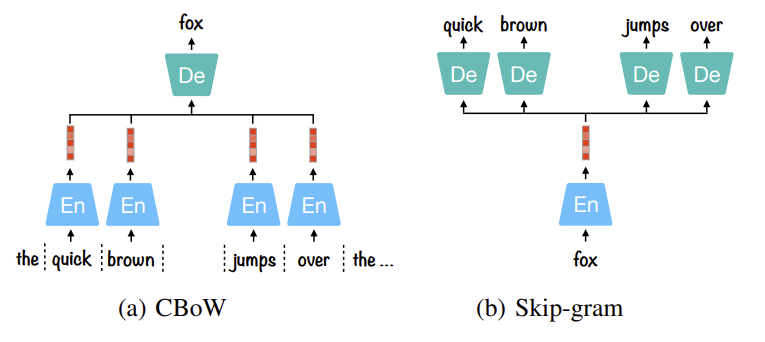
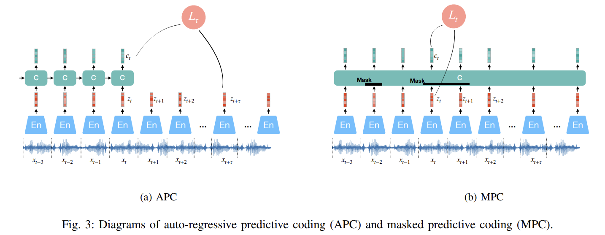
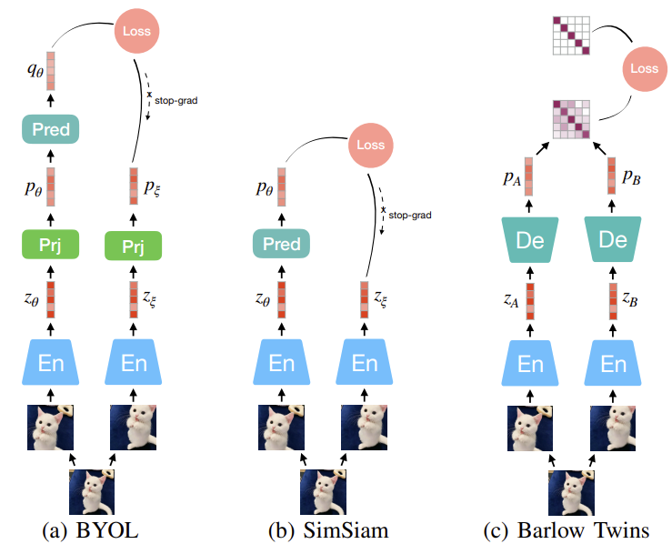
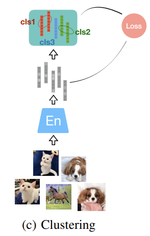

논문 :[Audio Self-supervised Learning: A Survey](https://arxiv.org/abs/2203.01205)  
연관 포스트: [Audio Self-supervised Learning: A Survey (2) Audio ]() 

# A) Views Generation
- SSL의 목적은 large-scale data에서 latent representation 찾기
- 같은 context에서 여러 view들을 얻기 위한 방법으로는 물체를 여러 방향에서 찍는 방법이 있음
- 하지만 같은 modality일 필요는 없음 >> multi-modelity & cross-modality는 SSL에서 자주 사용
    - text’s utterance
    - video’s audio and image frame within the same source
- CV에서는 data augumentation, Audio에서는 spectrogram에 warping or SpecAugment 진행
- 공간적 혹은 일시적인 일관성(coherence)과 전체적인 일관성(consistency)이 존재하기에 image의 다른 patch나 audio의 다른 segment도 multiple view로 고려됨
(같은 종류의 데이터일 때)
    - image: 가까운 frame은 positive, 같은 sequence지만 저 멀리 떨어져있는 frame과 다른 sequence에 있는 건 negative sampling
    - audio: 같은 녹음본에 있는건 positive, 다른 녹음본에서 가져오면 negative
- Global & Local
    - global representation은 context vector라고 종종 정의됨
    - SSL에서는 종합된(aggregated) global representation과 연관된 local representative을 배움
    - DeepInfoMax에서는 image를 global context vector로 코딩한 후, 그 image의 패치와 다른 이미지의 패치와의 거리를 비교
    - **3.Contrastive Predict Coding(CPC)** 에서는 Context vector는 auto-regressive한 방식으로 global information을 수집하고 그 vector가 local frame과 비교되어 학습 진행

 

# B) Frameworks

## 1. **Predictive Models**   
- optimizes the similarity or correlations between representations of two views of **same objects**

- ### **1) Auto-Encoding**
    

    
    

    
    
    | Examples | 요약 |
    | :---: | :---: |
    |Audio2Vec, BERT, Speech2Vec, Word2Vec|reconstruct the corrupted data while learning the latent representation|
    

    **설명**
    - latent dimension 크기를 잘 정해야함
        - 너무 크게 설정하면 identity function이 되어버릴 수 있음
        - 이를 막기 위해 denoising 방식이 사용됨 (zero-out: random하게 input의 일부값을 0으로 만듦)
        - zero-out 대신 data augmentation 사용하기도 함(cropping, reordering, colourisation…)  
     
        
    - 전체 원본은 예측하는 것이 아닌 일부분을 예측하는 모델도 많음
        - 대표적인 예가 바로 Word2Vec  
        

        
        

          
        - CBoW는 단어 사이의 구문적인(문법적인, syntactic) 관계 파악에 유리
        - 자주 사용하는 단어에 대해서 overfitting하기 쉬움
        - Skip-gram은 의미적인(semantic) 관계를 더 잘 파악하고 overfitting도 덜 함
        - Audio2Vec과 Speech2Vec는 audio segments(>> Mel Spectrogram으로 변환 후)를 fixed-length vector로 표현  
       

    - #### **Auto-Regressive Coding(APC) & Masked Predictive Coding(MPC) & Non-autoregressive Predictive Coding(NPC)**  
         
        

        
        

        - APC
            - 과거의 맥락/문맥(context)를 가지고 미래를 예측(future information conditioning)하는 모델
            - 추가적인 context network로 현재 time step의 표현(representation)들을 종합 >> 주로 RNN 사용
            - L1 loss로 optimization
            - forward와 backward 동시 진행이 불가능하여 분리하여 학습해야함
        - MPC
            - BERT model에 영감을 받아 bi-directional하게 학습
            - input signal의 일부분을 masking하면서 학습되는데, 양방향의 context를 사용하여 예측
            - Transformer와 bi-directional RNN이 MPC 구현의 대표적인 모델
            - (오타인가 모르겠지만 MPC라 했으니까) non-autoregressive way이므로 training 시간이 단축됨
        - NPC
            - model의 input에 mask를 씌움
            - 하지만 input sequence의 global보다 local한 dependency에 집중하여 representative를 학습
        - 다른 auto-encoding predictive model들은 signal의 상대적인 위치 예측
            - Jigsaw 퍼즐
            - 순서가 섞인 sequential한 input 재정렬  
             
 

- ### **2) Siamese Models**  
     

    

    
    
    

    | Examples | 요약 |
    | :---: | :---: |
    | BYOL, Barlow Twins, SimSiam | 같은 sample의 다른 view의 similarity 비교, 같거나 유사한 encoder 구조 사용 (우리 아는 "샴" 쌍둥이…)|

    **설명**

    - 각각의 encoder를 tower라고 칭함
        - 각각의 tower에 view가 다른 데이터를 넣어 natural similarity를 비교 >> 거리가 가까워야함
        - 학습되는 동안 한개의 tower은 다른 tower의 pseudo-label을 학습하는 걸로 생각할 수 있음
        - 각 tower의 parameter는 shared되거나 independent
        - 학습 목적 중에 negative sample을 추출하는 게 있으면, 이는 contrastive loss를 만들어 같은 view는 가깝게 negative sample은 멀리 밀어내면 됨
        - standard back-propagation으로 optimize  
     
    - Negative sample을 사용하지 않을 경우 mode collapse에 취약함
        - mode collapse : 다른 input의 output이 굉장히 유사(혹은 일치)하는 경우
        - 그러기에 contrastive learning을 이용하는 연구로 시작했음 (다른 페이지)
            - SimCLR, MoCo
        - 최근에는 posive pairs만 사용하는 연구들이 진행되고 있음 (이번 페이지)
            - BYOL, SimSiam, Barlow Twins  
     
        
    - #### **BYOL: Bootstrap Your Own Latent**
        - Online network: encoder f + projection layer g + predictor layer p
        - Target network: encoder f + projection layer g
        - online network의 predicted representation과 target network의 projection된 embedding의 거리가 가까워지도록 함
        - BatchNormalize가 collapse를 방지하는데 중요하다고 가정함
        - mode collapse를 막기 위해
            - asynchronously(비동기적) optimize
            - target network는 random하게 initalize되고 exponential moving average(EMA) 방식으로 update (MoCo와 유사)
                - $\theta: online \quad \xi:target \qquad \tau:\tau \in [0,1] \: decay \ rate \ for \ updating$
                    
                    $$
                    \xi\leftarrow\tau\xi+(1-\tau)\theta
                    $$

            - MSE로 optimize
                - $\bar{q_\theta}$ & $\bar{p_\xi}$: l2 normalized                   
                    
                    $$
                    L=\Vert \bar{q_{\theta}} - \bar{p_{\xi}} \Vert^2_2  \\
                    =2-2\frac{\langle q_\theta,p_\xi \rangle}{\Vert q_\theta \Vert_2 \cdot \Vert z_\xi \Vert_2 }
                    $$

            - 2개의 view를 바꿔서 다시 학습하여 $\tilde L$ 구하고, 최종 loss는 $L + \tilde L$
            - target network의 느린 업데이트는 online network의 parameter들을 점진적으로 종합하는 효과 >> mode collapse도 방지
            - LARS라는 optimizer도 추가적으로 이용
                - 다른 layer에 있는파라미터들을 다른 strength로 업데이트  
     
    - #### **SimSiam**
        - BYOL과 유사하지만, 차이점은…
            - projection layer를 사용하지 않음
            - target network는 학습하지 않고(not using back-propagation), online network에서 바로 copy해서 사용
            - target network 업데이트가 효율적이고 BYOL에서 사용한 momentum encoding을 사용하지 않음
        - 추가적으로 학습가능한 predictor와 stop-gradient operation이 model이 중요하지 않은 표현을 배우는 것으로부터 막는 중요한 부분
            - exponential moving average(EMA)를 사용하지 않아도
                - predictor가 자주 업데이트 되거나
                - learning rate가 크면 mode collapse 없이 수렴 가능
            - 하지만, predictor가 너무 자주 업데이트하거나 learning rate가 지나치게 크면 SimSiam에서 실패함(failure)
        - 최종 predictor의 l2 error minimal하도록 optimize
        - weight decay가 안정적인 수렴에 큰 도움
        - BYOL의 batch normalizaton을 group normalization과 weight standaedization으로 교체  
     
    - #### **Barlow Twins (BT)** [Barlow Twins](https://arxiv.org/pdf/2103.03230.pdf)
        
        - 신경과학자 H. Barlow의 redundancy reduction principle에서 영감을 받음
            
            > **“the goal of sensory processing is to recode highly redundant sensory inputs into a factorial code (a code with statistically independent components)”**
            > 
        - 똑같은 sample의 2개의 distorted data를 input으로 넣음
        - 두 개의 동일한 네트워크 사용
            - prediction layer가 없어서 training simplified
            - gradient-stopping이나 EMA가 없으므로 operation도 simple  
              
        - cross-correlation matrix가 identity matrix가 되도록 학습        
        - high-dimesional output vector에 대해 benefit 있음
        - loss function : invariance  term + redundancy reduction term
            
            $$
            L=\sum_i(1-C_{ii})^2+\lambda
            \sum_i\sum_{j\neq i}C_{ij}^2  \\
            
            C_{ij}=\frac{\sum_b p_{b,i}^A, p_{b,j}^B}{\sqrt{\sum_b{p_{b,i}^A}} {\sqrt{\sum_b{p_{b,j}^B}}}}
            $$
            
            - 두 네트워크의 output으로 cross-correlation matrix을 batch 방향으로 계산
            - invariance term
                - diagonal element를 1로 >> 두 개의 sample이 가까워지도록
            - redundancy reduction term
                - compress the correlations between the off-diagonal elements >> representations of sufficient disentanglement  
     
     

- ### **3) Clustering**
     
    

    
    

    
    | Examples | 요약 |
    | :---: | :---: |
    |DeepCluster, K-means, Local Aggregation, SwAV|pseudo-label 만들기|
    

    **설명**
    - 서로 다른 물체들은 자연적으로 구별되는 카테고리에 연관되어 있으며, 각 카테고리는 분리된 manifold를 차지할 것으로 생각
    - #### **DeepCluster**
        - 먼저, embedded vector들을 grouping하여 pseudo-labeling
        - classification loss를 사용하여 optimize
    - #### **Local Aggregation(LA)**
        - global clustering 대신에 LA 사용하면
        - 각각 sample마다 이웃하는 example과 식별할 수 있게하여,  more flexible statistical structure 생성 가능
        - local soft-clustering metric을 사용하여 학습이 더 효울적으로 진행
    - #### **SwAV**
        - Siamese architecture에 online clustering 추가
        - two-step에서 소요되는 시간 감소
        - pseudo-label들이 mini-batch 안에서 진행
        - multi-crop augumentation 소개: swapped prediction problem 해결이 목표, smaller crops
        
        [swav/README.md at main · facebookresearch/swav](https://github.com/facebookresearch/swav/blob/main/README.md)

 
 

## 2. **Contrastive Models**
 

- negative sample은 밀고, positive sample은 당기는 방법 >> contrastive loss을 디자인하는 것이 중요함

- ### **Contrastive Loss**
    - 초기 contrastive loss
        - “anchor + positive” or  “anchor + negative”
    - Max Margin contrastive loss
        - 같은 class면 embedding distance 최소화, 다른 class면 최대화
        - $\epsilon$: hyperparameter of lower bound distance between different samples
            
            $$
            L(x,x^+)=\sum_{x\in \mathfrak{X}} \Vert f(x)-f(x^+)\Vert^2_2
            $$ 
            
            $$
            L(x,x^-)=\sum_{x\in \mathfrak{X}} max(0,\ \epsilon -\Vert f(x)-f(x^-)\Vert_2)^2
            $$ 
            
    - Triplet loss
        - face recognition, “anchor + positive + negative”
        - $\epsilon$: hyperparameter of lower bound distance between different samples
            
            $$
            L(x,x^+,x^-)=\sum_{x\in \mathfrak{X}} max(0,\ \Vert f(x)-f(x^+)\Vert_2^2 -\Vert f(x)-f(x^-)\Vert_2^2+\epsilon)
            $$
            
    - Multi-Class N-pair loss
        - 다수의 negative samples과 joint comparisons, N=2면 triplet loss
        - softmax와 비슷한 수식(survey말고 원래 논문 수식 참고)
            
            $$
            L(x,x^+,x^-_{n\in [1,N-1]};f) = log(1+\sum_{n=1}^{N-1}{exp(f^Tf_i-f^Tf^+)}  \\
            =-log\frac{exp(f^Tf^+)}{exp(f^Tf^+)+\sum_{i=1}^{N-1}{exp(f^Tf_i)}}
            $$
            
    - NT-Xnet
        - normalized temperature-scaled cross-entropy loss
        - $\tau$: temperature parameter for controlling the penalty on the effect of negative samples
            
            $$
            L(x,x^+,x^-_{n\in [1,N-1]};f) = -log\frac{exp(f^Tf^+/\tau)}{\sum_{i=1}^{N-1}{exp(f^Tf_i/\tau)}}
            $$
            
    - InfoNCE
        - Noise Contrastive Estimation(NCE)에서 영감받음
        - positive pair와 N-1개의 negative pairs와의 거리 비교
            
            $$
            L(x,x^+,x^-_{n\in [1,N-1]};f) 
            =\mathbb{E}[-log\frac{exp(f^Tf^+)}{exp(f^Tf^+)+\sum_{i=1}^{N-1}{exp(f^Tf_i)}}]
            $$
            
        - 분모는 1개의 positive + N-1개의 negative으로 구성 >> softmax classifier로 N class cross-entropy 사용하여 optimize
        - classifier은 positive에 큰 값을, negative에는 작은 값을 줌  
     
- ### **Contrastive SSL for Siamese Models**
    - #### **SimCLR**
        - 다양한 data augmentation을 사용(random cropping, resizing, color distortions, Gaussian blur)
        - ResNet으로 encoding
        - Projection head (Dense-ReLU-Dense)
        - NT-Xnet을 objective function으로 사용 (contrastive loss에 설명 있음)
        - 이 방법의 성공 보장을 위한 “Scaling Up”의 중요성 강조
            - larger bath size, deeper & wider network, train longer epochs
            
    - #### **Momentum Contrast (MoCo)**  [설명된 blog](https://rauleun.github.io/MoCo)
        - negative sample은 이전 batch에서 가져옴 (representation 형식으로 queue에 저장됨)     
        - 2개의 encoder 사용, momentum encoder 추가
            - 똑같은 구조, 동일한 값으로 초기화
            - encoder은 back-propagation으로 학습
            - momentum encoder은 아래처럼 2개의 encoder를 linear interpolation 진행
                - q: encoder  k: momentum encoder  m: momentum
                    $
                    \theta_k\leftarrow m\theta_k+(1-m)\theta_q
                    $
                - momentum은 0.999로 설정하여 momentum encoder 값 업데이트를 느리게 진행
                - back-propagation하지 않으로 negative sample 수를 많이 늘릴 수 있음
            - encoder와 momentum encoder가 동시에 업데이트가 되기에 memory bank에서 일어나는 inconsistnecy 해결
                - memory bank
                    - memory bank는 모든 sample의 representation을 memory bank에 넣어두고, 임의 몇 개로 dictionary 구성
                    - encoder에서 나오는 값들로 memory bank update >> dictionary inconsistent      
         

        | 이름 | 설명 |
        | :---: | :---: |
        | MoCo v2 | SimCLR의 data augmentation 적용 (+Gaussian Deblur, larger batch size) encoder와 momentum encoder의 projection head 2-layers MLP로 수정 |
        | SimCLR v2 | ResNet-50 >> ResNet-152 + projection layer depth 개선 projection layer 한 개를 semi-supervised task의 fine-tuning용을 만듦 >> 적은 label된 data로 학습 MoCo v2의 memory mechanism을 사용하여 negative sample 수 늘림 |
        | MoCo v3 | memory queue 삭제 >> batch size 더 크게 키움 BYOL에서 제안된 projection layer 다음에 prediction layer 적용 |  

        
     

- **설명**
    - 이론적으로 두 개의 view가 label에 대한 redundant(불필요한/과다한) 정보줌
    - 그러기에 linear projection을 헤도 down-stream prediction task를 해도 성능 보장이 됨 [관련 논문](http://proceedings.mlr.press/v132/tosh21a/tosh21a.pdf)            
    - positive와 negative sample들의 거리를 비교하는 과정에서 representation collapse가 방지됨
    - NT-Xnet + InfoNCE

        $$
        L(x,x^+,x^-_{n\in [1,N-1]};f) 
        =\mathbb{E}[-log\frac{exp(f^Tf^+/\tau)}{exp(f^Tf^+/\tau)+\sum_{i=1}^{N-1}{exp(f^Tf_i/\tau)}}]  \\
        =\mathbb{E}[-f^Tf^+/\tau] \ (alignment)  
        + \mathbb{E}[log(exp(f^Tf^+/\tau)+\sum_{i=1}^{N-1}{exp(f^Tf_i/\tau)}]\ (uniformity)
        $$

        - alignment: positive pair 간의 similarity maximizing이 목표
        - uniformity: embeding된 vector를 단위구(unit sphere)의 형태로 normalize하기에 maximal-uniformly하게 분포가 가능 >> separable한 feature 추출 가능
        - $\tau$ (temperature coefficient)
            - sample 간의 관계를 고려하지 않고 서로 거리만 떨어지게 하는 instance discrimination objective와 다르게 작용
            - 다른 class와 구분은 되지만, 의미적으로(semantically) 비슷한 sample과 어느정도 가까운 것 허용
            - 너무 작으면, 비슷한 sample grouping할 때의 허용 오차(tolerance)를 넘어, 기본적인 의미마저 사라질 수 있음
            - margin과 비슷한 역할  
     
    - Wang suggestion  [Wang_Understanding_the_Behaviour_of_Contrastive_Loss](https://openaccess.thecvf.com/content/CVPR2021/papers/Wang_Understanding_the_Behaviour_of_Contrastive_Loss_CVPR_2021_paper.pdf)
        
        $$
        L_{align}=\mathbb{E}[\Vert f - f^+\Vert^\alpha_2  \\
        L_{uniform}=log\ \mathbb{E}[exp(-t\Vert f-f^-\Vert^2_2)]
        $$
        
        - 두 loss 동시에 minimize되도록 제안
        - 기존 contrastive loss보다 효과적  
         
            

## 3. **Contrastive Predictive Coding (CPC)**
- auto-regressive predictive model 이용
- 과거 frame들을 종합한 global context를 사용하여 미래 값을 예측하여 optimize
- InfoNCE loss의 query data point를 context vector $c_t$로 대체
    - $z_n^-$: $z_{t+\tau}$ 분포에서 sample된 negative data point, sequence $z$에서 random sampling

    $$
    L(c_t, z_{t+\tau},z^-_{n\in [1,N-1]}) = \mathbb{E}[-log\frac{exp(c^T_tz_{t+\tau})}{exp(c_t^Tz_{t+\tau})+\sum_{n=1}^{N-1}{exp(c_t^Tz_n^-)}}
    $$

    
    
- CPC v2
    - model 더 크게
    - batch normalize >> instance normalize
    - patch-based augmentation  
 
- Predictive Masked Predictive Models(MPC)
    
    $$
    L(c_t, z_{t},z^-_{n\in [1,N-1]}) = \mathbb{E}[-log\frac{exp(c^T_tz_{t})}{exp(c_t^Tz_{t})+\sum_{n=1}^{N-1}{exp(c_t^Tz_n^-)}}
    $$
    
    - 이 loss 조금 수정되서 wav2vec 2.0에서 사용됨
    - negative sampling은 CPC와 동일
 
 

# C) Training with or without negative samples
- 둘 다 model의 크기를 키우거나 representation 크기를 키우는 것에서 성능 향상 가능
- Contrastive learning에는 negative sample의 양과 질도 중요
    
    | contrastive | 장점 | 단점 |
    | :---: | :---: | :---: |
    | w/o | - complete한 representation을 code할 잠재력이 더 큼 | - sample 사이의 구별되는 특징에 대해 덜 배움 |
    | w/  | - sample 사이의 구별되는 특징에 대해 더 집중 - pretext task와 downstream task가 유사하면 유리 - downstream에 대해 fine-tuning하면 더 general complete representation 얻을 가능성 있음 | - reducing redundancy in representations for downstream tasks seems to be harder than restoring the lost representation completeness - w/o이 더 좋은 결과 내고 있음 |
 