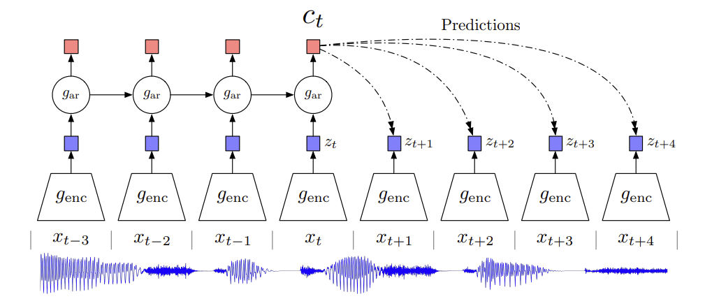
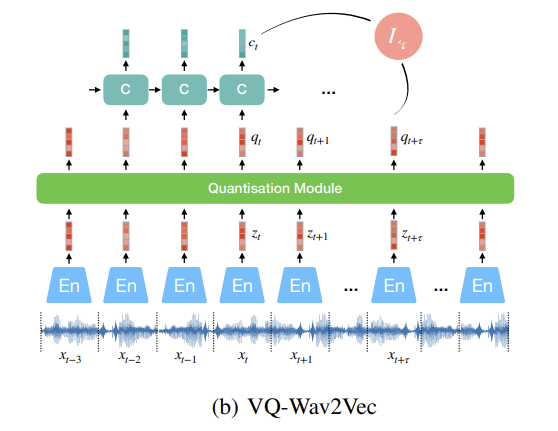
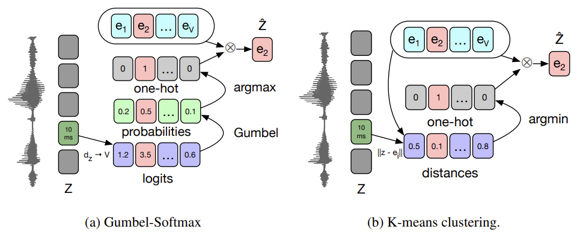

논문 : [Audio Self-supervised Learning: A Survey](https://arxiv.org/abs/2203.01205)  
연관 포스트: [Audio Self-supervised Learning: A Survey (1) A General Overview ]() 

분류 방식은 논문에는 Contrastive Model 중에서 Auto-Encoding/Siamese/Clusetering 그리고 Contrastive Model로만 분류가 되어 있습니다.  
세부적인 분류는 "Audio Self-supervised Learning: A Survey" 설명만 읽고 임의로 분류했기에 분류가 틀릴 수도 있습니다.

wav2vec 2.0 다음은 나중에 정리할 예정

<mark style='background-color: #A0BCC2'>**더 찾아봐야할 부분들**</mark>  
 

# 1. Predictive Models
## 1) Auto-Encoder
### **a) Basic Encoders**
1. Audio2Vec & Speech2Vec
    - **Word2Vec: CBow & Skip-gram**에서 영감받음
    - CBoW는 이전과 이후의 frame들을 가지고 가운데 비어있는 spectrogram frame 복원
    - CBoW는 acoustic scene classification에서 좋은 결과
    - Skip-gram은 주어진 frame으로 이전과 이후 frame 예측
    - | **Audio2Vec** | **Speech2Vec** |
      | :---: | :---: |
      | explicit한 도움 필요 없음    (supervision한 부분 완전 제거) | 각 단어에 맞는 audio slice segmentation을 위한    explicit forced alignment technique 사용|
      | CNN 기반 | RNN 기반 |
      | MFCC | Mel-spectrogram |
      | <mark style='background-color: #A0BCC2'>TemporalGap</mark>   (같은 audio clip 내에 random하게    sampled된 data 사이의 시간 차이 예측) | - |  

    - TemporalGap이 CBoW나 Skip-gram보다 더 좋은 결과를 내진 않았지만, pretext task를 상대적인 시간 측정이라는 새로운 관점 제시  
     
2. Carr et al.
    - audio patch suffle >> 다시 순서를 맞추는 방법 (permutation & jigsaw puzzle)
    - "Shuffle and Learn" 논문에서 아이디어 얻음 (audio classification 관련 논문)
    - <mark style='background-color: #A0BCC2'>end-to-end 학습을 위해 재정렬하는 방식을 개선: differential ranking(어떤 건지 확인 더 필요)<mark/>  
     
3. PASE & PASE+ (The Problem Agnostic Speech Encoder)    
    

    
    
  

    - CNN encoder 1개 + 여러개의 neural decoder(worker)
    - encoding된 값을 decoder에서 regression 혹은 binary discrimination
        - regression: recovering raw waveform, log power spectrogram, MFCCs, prosody(운율)
        - binary discrimination: contrastive learning: maximizing local and global mutual information(LIM/DIM과 유사), sequence predictive coding optimize(VQ-VAE와 유사)
    - unique expression of speaker voiceprint, phonemes, emotion 
    - raw waveform >> SincNet >> encoder input
    - PASE+
        - data augmentation
        - more efficient workers
        - [Quasi-RNN(QRNN)](https://arxiv.org/pdf/1611.01576.pdf): long-term dependencies capture에 더 효과적
 

### **b) Auto-regressive Predictive Coding (APC)**

### **c) Masked Predictive Coding (MPC)**
1. Masked Acoustic Model (MAM)
    - audio input의 일부분을 masking한 후, 전체 input reconsturct
    - reconstruction error 최소화  
     

2. Mockingjay  
       
    

    
    

    - Mel-Spectrogram
    - random making input을 transformer를 사용하여 coding
    - projection(2 layer MLP + layer normalization)한 후에 frame 예측에 사용 
    - transformer와 projection layer은 동시에 L1 reconstruction loss 최소화
    - transformer의 self-attention의 효과에 대한 연구와 visualization tool 제작   
 

3. Audio ALBERT
    - Mockingjay와 똑같은 구조
    - transformer encoder layer parameter 값 동유
        - 빠른 추리(inference), 빠른 학습 속도
        - performance 유지: speaker classificaion과 phoneme(음소: ㄱ,ㄴ,ㄷ,ㅏ,ㅓ,ㅗ ...) classificaion   
     

4. [TERA (Transformer Encoder Representations from Alteration)](https://arxiv.org/pdf/2007.06028.pdf)   
    - continuous >> randomness segments
    - channel 측 방향으로 masking (특정 frequency all zero)
    - Gaussian noise 추가
    - 2.Mockingjay와 3.Audio ALBERT보다 좋은 결과
        - performance 향상: speaker classificaion, phoneme classificaion, keyword spotting
        - ASR task에서 기대해 볼 만한 성능: Librispeech, TIMIT dataset  
     

### **d) Non-Auto-regressive Predictive Coding (NPC)**
1. DAPC
       
    

    
    
  

    - time뿐만 아니라 frequency도 함께 masking
    - 전체가 아닌 mask 부분만 reconstruction >> L1 reconstruction error 최소화
    - CBoW의 확장
    - SpecAugment로 쉽게 만들 수 있음 

 

## 2) Siamese
### **a) BYOL**
1. BYOL-A
    - 하나의 audio로 negative한 sample 없이 학습
    - log mel-filterbank  
 

# 2. Contrastive Models
## **a) SimCLR approch**
1. LIM Model
    - raw waveform 사용
    - 같은 utterance에서 나온 chunk들의 encoded representation 최대화  
     
2. COLA & Fonseca et al. 
    - time-frequency(spectrogram 형태) feature에서 시간(temporal) 축으로 positive sampling
    - patch에 data augmentation 
        - random size cropping
        - Gaussian noise addition
        - <mark style='background-color: #A0BCC2'>mix-back (incoming patch + background patch)</mark>  
     
3. CLAR
    - raw waveform이랑 time-frequency feature에 data augmentation 
    - <mark style='background-color: #A0BCC2'>다양한 augmentation에 대한 연구 진행</mark>
    - 상당히 적은 수의 labelled data를 사용하여 contrastive loss를 결합하면 SSL만 사용했을 때보다 수렴 속도, representation effectiveness의 개선이 있었음  
    - [CLAR 정리]()  
     

4. Wang
    - raw waveform과 spectral representation 사이의 호응(agreement) 최대화
    - Audioset, ESC-50 downstream task에 효과적  
     

# 3. Contrastive Predictive Coding (CPC)
1. [Van den Oord CPC ver1.](https://arxiv.org/pdf/1807.03748.pdf)
       
    

    
    
  

    - CPC: auto-regresive model의 latent space를 사용해서 미래 값 예측
    - Audio는 
        1. strided convolution을 사용하여 raw waveform encoding
        2. GRU가 과거의 timesteps을 통합하여 context vector 만듦
        3. contrastive loss(infoNCE)
            - context vector $c_t$를 주고, noise representations과 참값 비교
            - $z_n^-$: $z_{t+\tau}$ 분포에서 sample된 negative data point, sequence $z$에서 random sampling
            $$
            L(c_t, z_{t+\tau},z^-_{n\in [1,N-1]}) = \mathbb{E}[-log\frac{exp(c^T_tz_{t+\tau})}{exp(c_t^Tz_{t+\tau})+\sum_{n=1}^{N-1}{exp(c_t^Tz_n^-)}}
            $$
    - WavAugment library
        - pitch modification
        - add noise
        - reverberation
        - band regect filtering
        - time masking ...
    - CPC ver2.
        - 1 layer GRU >> 2 layers LSTM
        - linear prediction >> multi-head transformer
    

2. "Wav2Vec"s
       
    

    
    
    
    
  

    - (a) [Wav2Vec](https://arxiv.org/pdf/1904.05862.pdf?ref=https://githubhelp.com)
        - 위 CPC와 다르게 fully convolutional
            - 아래 cnn: audio representation 만듦
            - 위의 cnn: 각 timestep의 context vector에 대한 global context information capture
        - phoneme-based ASR >> character-bases ASR
        - contrastive loss for wach step $k=1, \cdots, K:$
          
            $$
            L_k = -\sum_{i=1}^{T-k}(log \ \sigma (z^T_{i+k}\ h_k(c_i)) + \lambda_{\tilde{z} \sim p_n} \mathbb{E}[log\ \sigma (-\tilde{z}^T\ h_k(c_i))])  \\
            L = \sum_{k=1}^KL_k
            $$

            - sigmoid $\sigma(x)={1}\ / \ (1+exp(-x))$
            - $\sigma (z^T_{i+k}\ h_k(c_i))$: $\ z_{i+k}$가 true sample일 확률  
            - $h_k(c_i)=W_kc_i+b_k$: step-specific affine transformation
            - expectation $\mathbb{E}$ 는 $p_n(z)=\frac{1}{T}$ 에서 10개의 negative sample을 뽑고 $\lambda$는 negative의 개수 (T: sequence length)
        - 학습 후에는 log-mel filterbank 대신에 $c_i$를 input으로 넣어줌  
         

    - (b) [VQ-Wav2Vec](https://arxiv.org/pdf/1910.05453.pdf)
        - audio representation 이산화하기 위해 wav2vec encoder 다음에 quantisation moodule 추가
            - 고정된 크기의 codebook $e \in \mathbb{R}^{V \times d}$ 에 있는 것과 가장 유사한 representation 찾기 (V representation with of size d)
        - argmax은 back-propagation 안 됨
               
            

            
            
  
            - Gumbel-Softmax나 online k-means clustering 사용
            - VQ-VAE나 vector-quantized autoregressive predictive coding과 유사
        - codebook 1개만 사용하면 실제로 사용되는 codeword가 적어서 mode collapse 발생 >> product quantization처럼 multiple codebooks 사용
            - product quantization은 여러개의 codebook에서 quantized된 representation을 고르고 concat하는 것과 동일 [product quantization 설명된 blog](https://datacrew.tech/product-quantizaton/)
            - 각 codebook에서 entry 하나씩 >> concat >> linear transformation 
            - group g의 v-th codebook을 고를 확률
                $$
                p_{g,v}=\frac{exp((l_{g,v}+n_v)/\tau)}{\sum_{k=1}^{V}exp((l_{g,k}+n_k)/\tau)}
                $$
                - $l\in \mathbb{R}^{G \times V}$: encoded dense representation >> projection's logits (V entries로 이루어져 있는 G개의 codebooks)
                - $n=-log(-log(u)) \qquad u \sim U(0,1): uniform$
                - $\tau$: non-negative temperature parameter
                - codeword i in group g는 $argmax_i \ p_{g,i}$
        - K-means clustering은 dense representation z와 가까운 codeword 선택하기
            - wav2vec loss에 term 추가
                $$
                L=\sum_kL_k+(\Vert stopgrad(z) - q\Vert^2 + \gamma\Vert z - stopgrad(q)\Vert^2)
                $$  
                codeword q가 encoder output과 비슷해지고, 각 encoder의 output이 codeword와 가까워지게(K-means clustering의 one centroid)
        - 그 후에 BERT model에 넣어서 학습

    - (c) [Wav2Vec 2.0](https://arxiv.org/pdf/2006.11477.pdf)
        - MPC
        - 이전 wav2vec 모델은 forward만 가능 >> bidirectional MPC
        - InfoNCE contrast loss 사용
        - raw waveform multiple 1D-CNN으로 encoding
        - mask 후 transformer
        - contextual representation이 주어졌을 때, 정답값과 distrator와의 contrast
        - quantized vector는 loss 계산에만 사용
            $$
            L=\mathbb{E}[-log\ \frac{exp(c_t^Tq_t/\tau)}{\sum_{\tilde{q}\sim Q_t} exp(c_t^T \tilde{q}/\tau)}]
            $$  
            $\tilde{q}\sim Q_t$: $q_t$와 K개의 distracter 포함
        - regularization은 diversity loss $L_d$로, model이 V codebook을 비슷하게 사용하도록
            $$
            L_d = \frac{1}{GV}\sum_{g=1}^G -H(\bar{p}_g) = \frac{1}{GV}\sum_{g=1}^G \sum_{v=1}^V\bar{p}_{g,v}\ log\ \bar{p}_{g,v} 
            $$
        - 현재 SOTA
        - speech recognition task를 위해서는 pre-training과 testing 조건을 잘 맞춰야함
        - 다양한 domain의 data 학습하는 것이 generalization에 도움됨 

