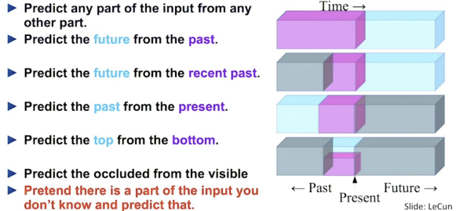
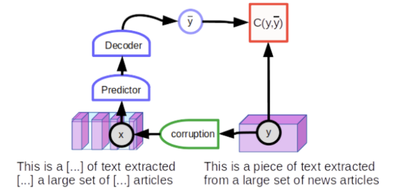
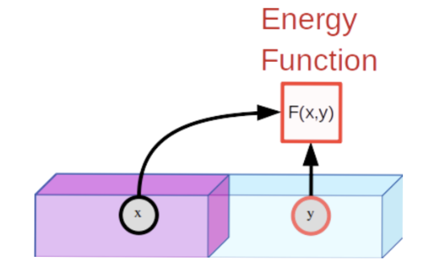
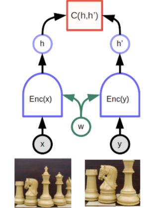

> **[Self-supervised learning: The dark matter of intelligence - META AI (FACEBOOK)](https://ai.facebook.com/blog/self-supervised-learning-the-dark-matter-of-intelligence/) blog post 정리**  

 

# 1. Common Sense is the Dark Matter of Artificial Intelligence

- 방대한 양의 labed된 데이터 수집에는 한계 존재
- 사람과 supervised learning은 둘 다 **COMMON SENSE(상식)** 을 학습하지만 차이 존재
- 사람에게 common sense는 모든 작업에 대해 많은 학습이 이루어지지 않아도 새로운 스킬을 배우는데 도움됨
    - ex1) 아이들에게 소 그림을 몇 장 보여주면, 소를 보면 바로 알아 볼 수 있음
    - ex2) 운전 연수 몇 시간 받으면 운전 가능
- supervised learning으로 학습된 AI에게 common sense는 dark matter(암흑물질)
    - ex) 수많은 소 사진을 보여주고 **unusual** 한 상황에서는 소라고 판단하지 못하기도 함
       소가 바닷가에서 누워있는 경우 >> 소는 초원이나 농장에 있기에 소가 아닐 것이다 판단
    - ex2) 완전 자율 주행 자동차는 몇 천 시간의 학습 필요  
       
- 사람은 이전에 습득한 배경 지식에 의존하여 세상 이해
- 그럼 AI는 어떻게 해야할까?
- \>> **Self-Supervised Learning** 이 사람과 유사한 common sense와 배경 지식을 근사할 수 있는 방법이라고 생각됨
- 더 많은 데이터로부터 학습 가능하기에 마묘하고 덜 흔한 개념(representation) 학습에 유리
- META AI-project SEER: label 없는 10억 개의 random한 이미지 사용하여 학습 진행  

 

# 2. Self-Supervised Learning is Predictive Learning

 

- self-supervised learning(SSL)는 데이터 자체(often 데이터 기본 구조 활용)에서 supervisoy 신호를 받음
- SSL의 일반적인 방법은 관측되지 않거나 가려진 input의 부분 **예측** 하기 
    - NLP: 문장에서 일부분을 가리고 들어갈 단어 예측
    - Video: 현재 관측되는 자료로 과거 혹은 미래의 frame 예측
- 데이터 자체의 구조 사용하기에 동시에 일어나는(co-occurring, e.g. video + audio) modalities(와의 결합 가능하며 label에 상관없이 수집된 다른 데이터셋 사용가능  

 

# 3. Self-Supervised Learning for LANGUAGE vs VISION   and Modeling the Uncertainty in Prediction

 

- LANGUAGE
    - 1000 단어 정도로 이루어져있는 짧은 문장의 일부분 mask/replace
    - mask/replace된 부분 예측
- language에 사용된 기법은 CV로 확장 쉽지 않음
    - NLP에서는 모든 전 어휘에서 가능한 단어들의 확률로 표현 가능  
      ex) The _____ chases the _____ in the savanna   
      \>> 첫 빈칸은 대초원에 있는 표식자들에게만 높은 점수, 나머지 단어는 낮은 점수  
      \>> softmax 사용 \>> 일종의 **classification** 으로 볼 수 있음
    - 이미지는 경우의 수가 무한 (uncertainty 표현 방법이 모호) \>>SWaV & SEER  
      high-dimenstional & continuous
- run time과 memory 측면 + 정확도가 떨어지지 않을만큼의 효율적인 model 구조 필요
    - FAIR에서 만든 RegNets: 10억~1조정도의 parameter를 가진 ConvNet, runtime과 memory limitation optimize 가능  

 

# 4. A Unified View of Self-Supervised Methods

 

- CV에서 활용방법은 없을까? >> Energy-based Model(EBM)으로 SSL을 통합해서 생각
- EBM 학습
    - (1) 위의 이미지라면 x, y가 조화롭고(compatible) low energy 가짐 >> 구현 쉬움
    - (2) y 값과 조화로운 x보다 다른 특정 부분의 조화롭지 않은 x'가 높은 에너지 가짐 >> 구현 어려움
    - ex) Image Reconstruction
      - x: 원본 이미지
      - y: x에서 살짝 왜곡된 이미지
      - 결과: low energy  
       

- **Joint Embedding, Siamese Networks**  

 

<em> w: share same parameters   function C: produce a scalar energy, measures the distance</em>

- 유사한 데이터를 넣어주어 low-energy로 만드는 것은 상대적으로 쉽지만, high-energy를 만드는 network를 만드는 것은 힘듦
- 특별한 제약을 주지 않으면, Siamese network들이 input을 무시하고 두 개의 똑같은 embedding을 만들 수 있음(**COLLAPSE**)
- collapse가 발생하면 nonmatching energy가 matching energy보다 높지 않음
- collapse를 피하기 위한 방법
    - 1.contrastive methods
    - 2.regularization methods

### **(1) Contrastive energy-based SSL**  

 

- 기존 NLP 접근 방법은 주어진 input에 대해 단 하나의 prediction만 나옴 >> 이미지에 적용할 수 없는 이유
- joint embedding architecture보다 좋은 결과는 아니지만 흥미로운 접근 방식이 있음 >> **latent-variable predictive architecture**
- Latent-Variable Predictive Architecture
	- z: extra input variable, 관측되지 않음
	- z도 set에 따라 변화함
	- 관측된 x에 대해 그럴듯한 예측값을 만들어냄
- contrastive method를 통해 학습됨
- 가장 좋은 예시가 GAN(Gererative Adversarial Network)
	- discriminator: input y가 괜찮아 보이는지 에너지 계산
	- generator: contrastive한 sample들을 만들어서 discriminator가 high energy 가진 것도 학습할 수 있게함
- 하지만 contrastive method 자체의 큰 문제 있음
	> Tolstoy’s Anna Karenina : “Happy families are all alike; every unhappy family is unhappy in its own way.”
    - 이미지와 같은 high-dimensional spaces에 대해 비효율적
	- 한 이미지가 다른 이미지와 다를 수 있는 방법은 엄청 다양
	
### **(2) Non-contrastive energy-based SSL**  
- 요즘 vision SSL에서는 non-contrastive가 hot한 방법
- DeepCluster, ClusterFit, MoCo-v2, SwAV, SimSiam, Barlow Twins, BYOL
- DeepCluster, SwAV, SimSiam: 비슷한 이미지 그룹에 대해 가상의 target embedding 계산
- BYOL, MoCo: 구조 혹은 parameter vector 값을 조금 다르게 해서 두 개의 joint embedding을 조금 다르게 만듦
- Barlow Twins: embedding vector의 각자의 요소의 redundancy(중복성)을 최소화  
 

- 가장 좋은 방법은 non-contrastive와 latent-variable predictive model을 합치는 것
- 주요 방해물은 latent variable의 용량(capacity)를 최소화하는 방법을 찾아야하는 것
	- latent variable이 바뀔 수 있는 set의 volume은 output이 low-energy를 가짐으로써 volume릏 제한할 수 있음
	 - 이 volume이 최소화되면서, 자동적으로 에너지의 분포가 알맞게 이루어질 수 있음  
- 1) Variational Auto-Encoder(VAE)가 대표적
	- latent variable이 흐릿(fuzzy)함으로 그 용량(capacity)을 제한
	- 하지만 아직 visual downstream task에 대해 좋은 representations을 나타내지는 않음
- 2) Sparse modeling도 다른 예시
	- 단순한 구조에만 사용 가능 

