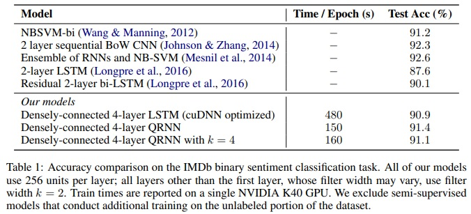

> [Quasi-RNN](https://arxiv.org/pdf/1611.01576.pdf)  

 

# 1. Why Quasi-RNN?

- RNN 장/단점
    - sequential한 학습 가능
    - 긴 sequences에 적합하지 않음
        - document classification
        - character-level machine translation
    - parallel 계산 불가능 >> 학습 시간이 길어짐
- CNN 장/단점
    - parallel
    - long sequences에 더 나은 확장성
    - pooling은 time-invariance를 가정 >> large-scale sequence order information에 부적절
- QRNN
    - CNN
        - timestamp & mini-batch에서 parallel 계산 가능
        - throughput 커짐
        - 긴 sequence 확장 용이
    - RNN
        - 순서를 고려한 학습 가능  
 

# 2-1. Model

크게 1)Convolution Component와 2)Pooling Component로 구성되어 있음

## 1) Convolution Component

- input: $T$ timestamp with $n$-dimension
    
    $$
    X \in \mathbb{R}^{T \times n}
    $$
    
- width가 $k$이고, $m$개로 이루어진 filter로 convolution
    
    $$
    Z\in \mathbb{R}^{T\times m}
    $$
    
    - 현재 timestamp은 미래의 data에 대해 알고 있으면 안 되기 때문에 “masked convolution” 사용
    - input 왼쪽에 $k-1$만큼 padding해서 masked convolution
    - convolution width가 클수록 character-level task에 유리
- pooling function을 위한 elementwise gates
    
    $$
    candidate\ vec\ :\ Z=tanh(W_z *X)  \\
    forget\ gate\  :\ F=\sigma(W_f*X)  \\
    output\ gate\ :\ O=\sigma(W_o*X)
     
    $$
    
    - $W_z$, $W_f$, $W_o$: $\mathbb{R}^{k\times n\times m}$
    - \* : masked convolution  
 

## 2) Pooling Component

- gate로 timestamp들의 state들을 섞으면서
- state vector의 channel에 독립적으로 작용
- f-pooling:

$$
h_t=f_t\odot h_{t-1}+(1-f_t)\odot z_t
$$

- fo-pooling:

$$
c_t= f_t\odot c_{t-1}+(1-f_t)\odot z_t  \\
h_t=o_t\odot c_t
$$

- ifo-pooling

$$
c_t= f_t\odot c_{t-1}+i_t\odot z_t  \\
h_t=o_t\odot c_t
$$

- $h$와 $c$는 처음에 0으로 초기화  
 

# 2-2. Variants

## 1) Regularization

- variantional inference-based dropout
    - recurrent connection의 dropout mask 고정해서 한 개의 recurrent weight stochastic subset pass
    - \>> QRNN에 사용 불가능
- zoneout
    - 각 timestamp의 channel subset을 dropout
    - QRNN의 f gate를 수정하는 방식으로 적용
        - f gate의 channel subset을 1로 만들거나
        - $1-f$에 dropout 적용
        
        $$
        F=1-dropout(1-\sigma(W_f*X))
        $$
        
        - 기존에 제공되고 있는(off-the-shelf) dropout layer 사용 시, 자동 rescaling function 사용하지 않아야 함
    - word emnedding과 QRNN 사이에는 기존 dropout 사용했음  
 

## 2) Densely-Connected Layers

- 모든 QRNN layer 사이에 skip-connection 쓰는 게 도움됨
    - gradient flow & convergense
    - 하지만 layer 개수에 대해서는 quadratic 해야함
- QRNN layer의 input을 다음 layer에 전달하기 전에 channel dimension으로 concatenation하는 것과 동일
- 마지막 layer의 output은 전반적인 encoding 결과 의미  
 

## 3) Encoder-Decoder Models

- seq2seq task를 위한 구조 확장
- encoder는 기존 QRNN 그대로 사용
- decoder는 attention을 사용해 강화한 modified QRNN 사용
    - 마지막 encoder의 (pooling을 거친) hidden-state를 decoder의 pooling layer의 input으로 넣어줌
        - decoder pooling layer로 전달되는 gate나 update value에 encoder state가 영향 주지 않음
        - decoder의 representational power limit
    - 각 decoder의 convolution function output은 최종 encoder hidden state로 보충됨
        - convolution layer $l$의 output 값들(e.g. $W_z^l * X^l in \mathbb{R}^{T\times m}$)을 layer $l$의 마지막 encoder state(e.g. $V_z^l \tilde{h}_T^l in \mathbb{R}^{Tm}$)의 linearly projected copy($V_z^l$)에 broadcasting해서 더해줌
        
        $$
        Z^l=tanh(W^l_z * X^l+V^l_z\tilde{h}^l_T)  \\
        F^l=\sigma(W^l_f * X^l+V^l_f\tilde{h}^l_T)  \\
        O^l=\sigma(W^l_o * X^l+V^l_o\tilde{h}^l_T)    
        $$
        
        - $\tilde{h}$: encoder variable
    - [soft attention]([https://arxiv.org/pdf/1409.0473.pdf](https://arxiv.org/pdf/1409.0473.pdf))을 추가하면 긴 sequence에 대해 더 powerful하게 작용
        - context vector $c_i$를 사용해서 softmax attention weight 계산 >> backpropagation 가능
        - 전체 input representation이 fixed-length encoding vector로 만들 필요 없음
        - 논문 실험에서는 encoder의 마지막 hidden state에 attentional sum해줌
        - encoder의 hidden states를 softmax를 거쳐 각 decoder의 timestamp에 더해줄 attentional sum $k_t$ 만들어줌
        - 위 값을 decoder의 un-gated hidden states의 dot product
        - 이 decoder 값은 output gate을 거치고 linear layer에 넣어줌
        
        $$
        \alpha_{st}= \underset{all \ s}{softmax}(c_t^L \cdot \tilde{h}_s^L)  \\
        k_t=\sum_s\alpha_{st}\tilde{h}_s^L  \\
        h_t^L=o_t \odot(W_kk_t+W_cc_t^L)
        $$
        
        - $L$: last layer, $c_t^L$: decoder ungated hidden states  
 

## 3. Experiments
### 3-1. Sentiment Classification
 

- Dataset: IMDb movie review dataset
    - Document level
    - +: 25,000  -: 25,000
    - avg words: 231
    - small batch and long sequence length  
 

### 3-2. Language Modeling
 

 

### 3-3. Character-Level Neural Machine Translation
 

 
