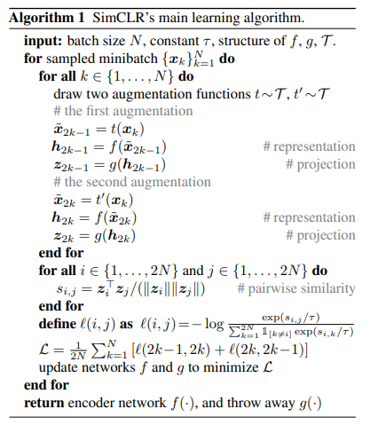
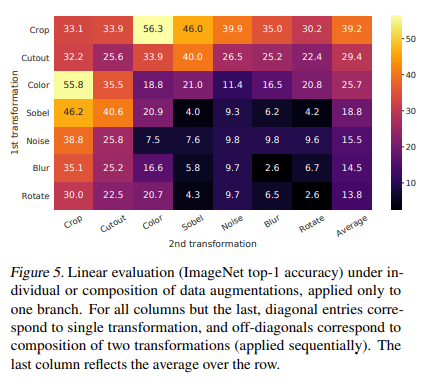
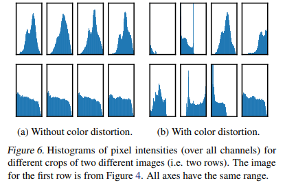

> [SimCLR: A Simple Framework for Contrastive Learning of Visual Representations](https://arxiv.org/pdf/2002.05709.pdf)  

연관 포스트: 
1. [Audio Self-supervised Learning: A Survey (2) Audio]()  
2. [CLAR]()  

> **Abstract**  
contrastive self-supervised learning without specialized architectures or a memory bank  
> 1. predictive task에 data augmentation이 중요함  
> 2. representation과 contrastive loss를 계산 중간에 learnable nonlinear transformation을 넣으면 representation이 더 좋아짐  
> 3. contrastive learning은 supervised learning보다 큰 batch size, 더 긴 training step에 더 이득  

# 1. Introduction
- supervision 없이 학습하는데 주류는 2 가지: Generative or Discriminative
- **Generative**
    - 만들어내거나 input space에 pixel을 모델링
    - pixel-level generation은 expensive하고 representation learning에 필수적인 건 아닐 수 있음
- **Discriminative**
    - objective function으로 representative 
    - supervised learning과 비슷하지만, pretext task를 수행하여 input과 label이 unlabeled dataset으로부터 나오도록 학습
- **SimCLR**
    - data augmentation의 다양한 조합이 contrastive prediction task에 중요함을 보임
    - supervised보다 unsupervised contrastive learning이 data augmentation에 더 영향을 많이 받음
    - representation과 contrastive loss를 계산 중간에 learnable nonlinear transformation을 넣으면 representation이 더 좋아짐 
    - normalized된 embeddings과 적절한 temerature parameter $\tau$ 가 contrastive cross entropy loss에 유리
    - 더 큰 batch size와 긴 training이 supervised보다 contrastive learning에 더 유리
    - supervised와 contrastive learning 둘 다 deeper & wider networks에 더 잘 학습됨  
 

# 2. Method 
## 1) The Contrastive Learning Framework
- latent space에서 같은 data를 다르게 augmentation한 view들의 agreement 최대화

    

  

- 4가지 요소로 구성
    1. **stochastic data augmentation module**
        - 같은 example에서 random하게 생성된 두 개의 상호연관된 2개의 view들($\tilde{x}_i$, $\tilde{x}_j$)은 positive pair
        - 3 가지 simple augmentation 순서대로 적용 : random cropping(and resize to original size) > random color distortions > random Gaussian blur
        - radom crop & color distortion이 가장 결정적이었음 (**3.Data Augmentation for Contrastive Representative Learning**에 더 자세히 설명)  
         
    2. **base encoder $f(\cdot)$**
        - augmented data에서 representation vector 추출
        - ResNet 사용
        - $h_i=f(\tilde{x}_i)=ResNet(\tilde{x}_i)$
        - $h_i \in \mathbb{R}^d$는 average pooling layer의 output  
         
    3. **projection head $g(\cdot)$**
        - contrastive loss를 적용할 space로 representations mapping
        - hidden layer 1개 사용
        - $z_i=g(h_i)=W^{(2)}\sigma(W^{(1)}h_i)$
        - $\sigma$ = ReLU
        - $h_i$에서보다 $z_i$에서 contrastive loss 계산하는게 더 좋음 (**4.Architectures for Encoder and Head**)  
- mini-batch 구성
    - N 개의 examples를 random sampling한 후에, augmented pair로 만들어서 최종적으로 2N 개의 data points로 구성된 mini-batch를 듦
    - positive pair만 주고, 나머지 $2(N-1)$개는 negative examples
    - NT-Xent: Normalized Temperature-scaled Cross Entropy Loss

    $$
    \mathcal{L}_{CL}=-\sum_{i,j}^Nlog\frac{exp(sim(\mathbf{z}_i, \mathbf{z}_j)/ \tau)}{\sum_{k=1}^{2N}\mathbf{1}_{[k \neq i]} exp(sim(\mathbf{z}_i, \mathbf{z}_j)/ \tau)}
    $$

    - $\mathbf{1}_{[k \neq i]}\in 0,\ 1$ : $k \neq i$일 때만 1 아니면 0
    - $\tau$ : temperature parameter (default 0.5) 
    - $\mathbf{z}$ : encoded representation
    - $N$ : mini-batch size
    - $(i,\ j)$: positive pairs
    - $sim(\mathbf{u}, \mathbf{v})$ : $sim(\mathbf{u}, \mathbf{v}) = \mathbf{u}^T\mathbf{v} / \Vert\mathbf{u}\Vert\Vert\mathbf{v}\Vert$ cosine similarity, dot product between two $\mathcal{l}_2$ normalized vector $\mathbf{u}$ and $\mathbf{v}$  
       

    

    
    
    
  
 

## 2) Training with Large Batch Size
- memory bank 사용 안함
- Batch size N = 256 ~ 8192
- N = 8192면, 하나의 positive pair에 대해 16382개 negative example 존재
- batch size가 커지면 standard SGD/Momentum with linear learning rate scaling을 쓰면 학습이 불안정해짐
    - 모든 batch size에 대해 LARS optimizer 사용
- Global Batch Normalization
    - BN은 local한 하나의 device에 대한 mean/variance
    - positive pair는 같은 device에 존재하기에 다른 device에서 information leakage 발생 가능
    - **(1) 모든 devices에 대한 BN 계산** << SimCLR에서는 이 방법 사용
    - (2) devices 전체적으로 data shuffling
    - (3) BN 대신 layer norm 사용  
 

## 3) Evaluation Protocol
- Dataset and Metrics
    - ImageNetILSVRC-2012 dataset / CIFAR-10 사용
    - represetation 테스트를 하기 위해 freeze한 base network 위에 linear classifier 추가
- Default setting
    |     | 내용 |
    |:---:|:---:|
    |**augmentation**| random cropping(and resize to original size) > random color distortions > random Gaussian blur|
    |**base encoder**| ResNet-50|
    |**projection head**| 2-layer MLP to 128-dimensional latent space|
    |**loss**| NT-Xent|
    |**optimizer**| LARS with lr 4.8 $(=0.3\times batch_size/256)$|
    |**weight decay**| $10^{-6}$|
    |**linear warmup**| for 10 epochs|
    |**scheduler**| cosinedecay without restarts|  
 

# 3.Data Augmentation for Contrastive Representative Learning
## 1) Conposition of data augmentation operation is crucial
- Conposition of data augmentation operation is crucial for learning good representation
- spatial/geomatric 혹은 appearance transformation이 존재하고 아래 이미지들이 SimCLR에서 비교 및 분석한 실험들

- 이미지 크기가 다르기 때문에 항상 crop >> crop의 영향을 알 수 없다는 문제
    - crop에 대한 영향을 알기 위해, 항상 random crop하고 같은 해상도로 resize
    - 그 후, 하나의 branch에만 target augmentation 진행
    - performance는 안 좋아지지만 각각에 대한 영향 파악 가능  
     

- 대각선은 augmentation 한 개만 함:  
contrastive task에서 positive pair를 찾을 수 있지만, representation 결과가 안 좋음
- 하지만 2개 이상으로 사용했을 때 문제는 어려워지지만, representation은 좋아짐
- 조합 중에서 random cropping + color distortion 결과가 압도적으로 좋았음
    - random cropping을 해도 pathch들 간의 color histogram은 유사

  

# 4.Architectures for Encoder and Head