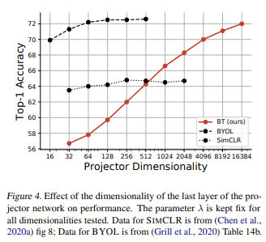
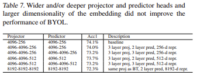

> [Barlow Twins: Self-Supervised Learning via Redundancy Reduction](https://arxiv.org/pdf/2103.03230.pdf)  

연관 포스트: 
1. [Audio Self-supervised Learning: A Survey (1) A General Overview]()  

> **Abstract**  
> 1. 같은 데이터에서 왜곡된(distorted/augmented) 두 개의 sample을 똑같은 network를 통과한 output의  cross-correlation matrix을 계산하여  
자연스럽게 collapse를 피할 수 있는 objective function 제안
> 2. 다른 SSL과 다르게 large batch size가 필수가 아니고, network twin도 비대칭 아님
> 3. very high-dimensional output vector에 이점 있음

# 1. Introduction
- SSL 방식들은 공통적으로 다양한 distortion/data augmentation에 invariant한 representation 학습을 목표로 함
- 여러가지 Siamese Network에 sample의 distorted version을 넣고 representation의 유사도를 최대화하는 방법 사용
- **(1) Contrastive Methods**
    - ex) SimCLR [설명 포스트]()
    - 'positive'와 'negative' sample pair를 구성
    - loss function에서 각각 다르게 취급됨
    - main network과 momentum encoder를 비대칭적으로 update하는 방식 사용 가능  
     

- **(2) Clustering Methods** 
    - 2개의 distorted sample 중,  
    1개는 loss target   
    다른 1개는 위의 target을 predict
    - optimization scheme: k-means(DeepCluster), non-differentiable operators(SwAV, SeLa)  
     

- **(3) Similar Line of Works**
    - ex) BYOL, SimSiam
    - 비대칭
        - 구조: predictor network
        - parameter update: 한 개의 distorted sample로 network update  
        'stop-gradient'가 문제 해결에 필수  
         
- **Barlow Twins with _Redundanct-Reduction_**
    - Barlow의 _Possible Princiles Undelyding the tTransoration of Sensory Messages_에서 나온 개념
    - sensory processing은 high-redundant sensoty input을 fatorial code로 recoding하는 것
    - factorial code: 통계적으로 독립된 구성 요소로 이루어진 code
    - twin embeddings으로 만든 cross-correlation matrix를 identity matrix과 가깝도록 object function 구성
    - 큰 batch, 비대칭적인 구조(prediction network, momentum encoder, non-differentiable operators, stop-gradient) 필요 없음
    - high-dimensional embedding에 유리  
 

# 2. Methods 
## 1) Description of Barlow Twins
 

  

### (1) Network 구조
- distorted images에 대한 joint embedding 진행
- dataset에서 sample된 batch $X$ 에 data augmentations $\mathcal{T}$ 하여 distorted view로 구성된 batch $Y^A,\ Y^B$ 생성
- function $f_\theta$ 에 넣어서 embeddings $Z^A, \ Z^B$ 만듦 (trainable parameters $\theta$)
- $Z^A, \ Z^B$ 는 batch dimension에서 mean-centered(zero mean)로 가정  
 

### (2) Loss Function $\mathcal{L}_{\mathcal{BT}}$

$$
\mathcal{L}_{\mathcal{BT}} \triangleq \underbrace{\sum_i(1-C_{ii})}_{\text{invariance term}} + \lambda \underbrace{\sum_i\sum_{i\neq j}C_{ij}^2}_{\text{redundancy reduction term}} 
$$
 
- $\lambda$: 첫번째와 두번째 loss term의 균형(trading off the importance)을 위한 positive constant 
- $C$: 똑같은 network의 batch dimension을 따라 나온 outputs의 cross-correlation matrix 
    $$
    C_{ij} \triangleq\frac{\sum_b\ z_{b,i}^A\ z_{b,j}^B}{\sqrt{\sum_b\ (z_{b,i}^A)^2}\ \sqrt{\sum_b\ (z_{b,j}^B)^2}}
    $$
    - $b$: batch sample index
    - $i,\ j$: networks' outputs vector dimension index
    - $C$: network output 크기의 square matrix,  
    -1(perfect anti-correlation) ~ 1(perfect correlation)
- **_invariance term_**
    - cross-correlation matrix의 주대각선 성분들을 1에 가깝도록 
    - embedding이 distortion에 invariant 하도록
- **_redundancy reduction term_**
    - 주대각선 성분이 아닌 element가 0이 되도록
    - embedding의 vector components decorrelate
    - output units 간의 redundancy 줄여줌
    - embedding vector의 _soft-whitening_ constant로 볼 수 있음 (**5. Discussion에서 다룸**)
- 정보 이론의 _Information Bottleneck(IB) Objective_ 으로도 해석 가능
    - Appendix A에 정리됨
- 장점
    - (1) large number of negative sample이 필요 없어서 작은 batch에서도 잘 작동됨
    - (2) benefits from very high-dimensional embeddings  
 

 
 

## 2) Implementation Details
### (1) Image Augmentation
- 각 input image는 2번 transformation 수행
- 항상 : random cropping, 224 $\times$ 224 resizing
- 랜덤 : horizontal flipping, color jittering, convert to grayscale, Gaussian blurring, solarization(과노출로 반전)
- 뒤 2개의 확률은 다름
- BYOL 논문과 똑같은 augmentation parameter 사용  
 

### (2) Architecture
- encoder: ResNet-50 (final classification layer 없이 2048 output)
- projector network
    - 3 linear layer
    - 모두 8192 output units 
    - layer 사이에 Batch Normalization layer와 ReLU 사용
- **input** $\quad=$ encoder $\Rightarrow\quad$ **representation** $\quad=$ projector $\Rightarrow\quad$ **embedding**
- embedding은 downstream task에 사용하고, embedding은 loss 계산에 사용  
 

### (3) Optimization  

| 방법 | 내용 |  
|:---:|:---:|  
|**epoch**|1000|  
|**batch size**|2048 (256~)|  
|**optimizer**| LARS|  
|**learning rate**|weight: $0.2 \times (batch\_size/256)$ bias & batch norm: $0.0048 \times (batch\_size/256)$|  
|**weight decay**| $1.5\times 10^{-6}$|  
|**linear warmup**| for 10 epochs|  
|**scheduler**| cosine decay, factor 1000|  
|**trade off parameter**|$\lambda=5\times 10^{-3}$|  
|**기타**|bias와 batch norm parameters은 LARS adaptation과 weight decay에서 제외됨|  

 

# 3. Results
## 1) Linear and Semi-Supervised Evaluation on ImageNet
**\<Linear Evaluation on ImageNet>**

 
 

**\<Semi-Supervised Evaluation on ImageNet>**

 
 

## 2) Transfer to Other Datasets and tasks
**\<Image Classification with Fixed Features>**

<em> ResNet-50 Freeze</em>

- Places-205: scene classification
- VOC07: multi-label image classification
- iNaturalist2018: fine-grained image classification  
 

**\<Object Detection and Instance Segmentation>**

<em> Fine-tune ResNet-50</em>

 

# 4. Ablations
- 1000 epochs $\Rightarrow$ 300 epochs
- accuracties는 ImageNet training set에서의 2048 dimension으로 학습된 결과값들  
 

## 1) Loss Function Ablations

  
<em> (a)Baseline ~ (g)Cross-entropy with temp.</em>

 

- (b): removing invariance term(on-diagonal) $\Rightarrow$ worse
- (c): removing redundancy reduction term(off-diagonal) $\Rightarrow$ collapsed  
 
- (d): normalize along feature dimension(unit sphere) $\Rightarrow$ slightly reduced
    - embedding을 batch dimension으로 normalize(with mean subtraction)  
    $\Rightarrow$ embedding을 feature dimension으로 normalize(without mean subtraction)  
    $\Rightarrow {\text{normalized cross-correlation 아닌}} \rightarrow \text{unnormalized covariance matrix}$  
- (e): projector network에서 batch normalization 제거 $\Rightarrow$ barely affected
- (f): (e) + loss의 cross-**correlated** matrix를 cross-**covariance** matrix로 바꿈(batch 축으로 noramlize 안 함) $\Rightarrow$ substainally reduced  
 
- (g): cross-entropy with temperature $\tau$ $\Rightarrow$ reduced
    $$
    \mathcal{L}=-log\sum_i exp(C_{ii}/\tau) + \lambda log\sum_i\sum_{i\neq j}exp(max(C_{ij},0)/\tau)
    $$
 

## 2) Robustness to Batch Size

  

- performed grid search of LARS learning rate for each batch size  
 

## 3) Effect of Removing Augmentations

  

- not robust to augmentations like SimCLR $\rightarrow$ BYOL is robust
-다르게 보면, 특정한 distortion 사용애 대해 control이 더 좋음  
 

## 4) Projector Network Depth & Width

  

- BYOL과 SimCLR은 projector network에서 ResNet output을 엄청 줄이고 일정 수준 이상 output이 커져도 변함 없음(saturate) 
- Barlow Twins는 projector network의 output이 크면 클수록 좋음
- ResNet-50의 output은 2048로 고정되었음에도 이런 결과 나옴
- 다른 방법들과 유사하게 projector network layer가 많로질수록 좋았고, 3 layer에서 saturate  
 

## 5) Breaking Symmetry

  

- asymmetries가 성능을 더 해침  
 

## 6) BYOL with a Larger Projector/Predictor/Embedding

  

- 성능이 좋아지진 않음   
 

## 7) Sensitivity to $\lambda$

  

- $\lambda$에 sensitive 하지 않음  
 

# 5. Discussion
## 1) Comparison with Prior Art
### (1) InfoNCE
- Contrastive SSL 에서 자주 사용하는 loss function
- InfoNCE
    - $b$: sample index
    - $i$: output의 vector component index
    - $z^A,\ z^B$: twin network outputs
    - $\tau$: temperature in analogy to statistical physics  

$$
\mathcal{L} \triangleq - \underbrace{\sum_b\frac{\langle z_b^A,\ z_b^B\rangle_i}{\tau\Vert z_b^A\Vert_2\ \Vert z_b^B\Vert_2}}_{\text{similarity term}}+\underbrace{\sum_b log(\sum_{b'\neq b}exp(\frac{\langle z_b^A,\ z_b^B\rangle_i}{\tau\Vert z_b^A\Vert_2\ \Vert z_b^B\Vert_2}))}_{\text{contrastive term}}
$$

- Barlow Twins loss re-write  

$$
\mathcal{L_{BT}} = - \underbrace{\sum_i(1-\frac{\langle z_{\cdot,\ i}^A,\ z_{\cdot,\ i}^B\rangle_b}{\Vert z_{\cdot,\ i}^A\Vert_2\ \Vert z_{\cdot,\ i}^B\Vert_2})^2 }_{\text{invariance term}}+\underbrace{\lambda\sum_i\sum_{j\neq i}(\frac{\langle z_{\cdot,\ i}^A,\ z_{\cdot,\ i}^B\rangle_b}{\Vert z_{\cdot,\ i}^A\Vert_2\ \Vert z_{\cdot,\ i}^B\Vert_2})^2}_{\text{redundancy reduction term}}
$$

- 공통점
    -  distorted된 data를 twin network에 넣어도 embedding이 invariant하게, 학습된 embedding에 대해서는 variability가 maximized하는 것이 목표
    - 위의 variability에 대한 측정이 batch statistics에 의존
- 차이점  

|InfoNCE|Barlow Twins|  
|:---:|:---:|  
|sample들의 모든 pair에 대한 **pairwise distance**를 최대화하므로써 embedding variability 최대화|embedding vector **decorrelation**을 통해 embedding variability 최대화|  
|**non-parametric estimation** of the **entropy** of the distribution of embeddings - prone to the curse of the dimensionality - require a large number of samples|**_proxy_ entropy estimator** of the distribution of embeddings under a **Gaussian parameterization**(Appendix A) - simplification $\rightarrow$ fewer samples, very large dimensional embeddings|  
|normalized along the **feature** dimension(cosine similarity)|normalized along the **batch** dimension|  
|trade off parameter 없음|trade off parameter $\lambda$ 있음(Appendix A)|  
|hyperparameter $\tau$ 있음 - non-parametric kernel density estimation의 kernel width로 해석 가능 - batch 안의 hardest negative sample에 대한 상대적인 중요도의 weight 값| - |  

- Diff with MoCo
    - MoCo 
        - large batch에 대한 의존도 낮춤
        - negative samples로 이루어진 dynamic dictionary ($\gt 60,000 \text{ sample embeddings}$)와 moving-averaged encoder
    - Barlow Twins
        - 큰 dictionary 필요없고, 작은 batch에서도 잘 작동함  
 

### (2) Asymmetric Twins
- BYOL과 SimSiam은 simple cosine similarity를 사용하여 contrastive term 없이도 문제를 성공적으로 해결

$$
\mathcal{L}_{cosine}=-\sum_b\frac{\langle z_b^A,\ z_b^B\rangle_i}{\Vert z_b^A\Vert_2\ \Vert z_b^B\Vert_2}
$$

- **BYOL**
    - predictor network가 대칭적 구조를 깸
    - exponential moving average가 target network weight 학습을 늦춤
    - 다른 연구에서 collapse를 방지하기 위해, moving average는 필수적인 요소는 아니지만,  
    하나의 branch에 stop-gradient를 적용하는 것과 predictor network는 필수적임을 밝힘
    - batch normalization 혹은 (alternatively) group normalization 또한 collapse를 피할 수 있는 요소라고 함
    - Barlow Twins처럼 large batch나 batch 안의 다른 sample과의 관계를 objective function에서 고려할 필요 없음  
     
    - **하지만,** 비대칭적인 방법은 전반적인 학습 목표에 대한 최적화로 설명될 수 없음
    - implementation choices나 non-trivial learning dynamics의 결과를 통해 피함
    - Barlow Twins는 construction으로 문제 해결(until their principle is discovered)  
 

### (3) Whitening
- W-MSE: twin networks의 whitened embeddings 사이의 simple cosine similarity 계산하기 전에  
각 batch embedding의 미분가능한 whitening operation
- Barlow Twins의 redundancy reduction term이 batch embeddings의 whitening encourages  
 

### (4) Clustering
- contrastive-like 비교를 하지만, 모든 pairwise 거리를 계산하지 않음
- collapse에 약함(k-means의 empty cluster, careful implementation 필요)
- batch size에 상관없이 학습은 가능하나, cluster 개수가 batch 크기보다 크면 feature들을 보관해야 할 필요가 있음  
 

### (5) Noise as Targets
- sample들을 fixed random targets on the unit sphere  
(whitening으 한 형태로 해석 가능)
- single network 사용, distortion 안 사용함
- 학습될 representation의 flexibility 제한할 수 있음  
 

### (6) IMAX
- SSL 초기의 loss function

$$
\mathcal{L}_{IMAX} \triangleq log\ \vert \mathcal{C}_{(Z^A-Z^B)}\vert - log\ \vert \mathcal{C}_{(Z^A+Z^B)}\vert
$$

- $\vert\quad \vert$: matrix의 determinant
- $\mathcal{C}$: convariance
- Barlow Twins과 유사한 방법이나,  
IMAX는 바로 information quantity로 계산하고, extra trade-off parameter $\lambda$ 없음  
 

## 2) Feature Directions
- embedding dimension이 클 수록 성능이 좋아졌으나, memory 사용량이 커지기에 잉 대한 새로운 방법 추가 연구 필요
- Information Bottleneck principle의 하나의 implementation이기에 더 개발할 여지가 많음  
 

# Appendix A
 

- Mutual Information(MI) 
    - [설명된 블로그](https://process-mining.tistory.com/141)
    - joint distribution $p(X,\ Y)$가 $p(X)p(Y)$와 얼마나 비슷한지 측정
    $$
    \mathbb{I}(X;\ Y) \triangleq \mathbb{KL}(p(x,y)\Vert p(x)p(y)) = \sum_y\sum_x p(x,y)log\frac{p(x,y)}{p(x)p(y)}
    $$
    - X, Y가 independent하면,  
    $p(x,y)=p(x)p(y)\quad \Rightarrow\quad log\frac{p(x,y)}{p(x)p(y)}=1 \quad\Rightarrow\quad MI = 0$  
     

    - 이를 conditional entropy로 바꾸면
    $$
    \mathbb{I}(X;\ Y) = \mathbb{H}(X) - \mathbb{H}(X \vert Y) = \mathbb{H}(Y) - \mathbb{H}(Y \vert X)
    $$
    - $\mathbb{H}$: entropy
    - $Y$에 대한 정보를 앎으로써 $X$에 대한 불확실성이 얼마나 감소했는지?  
    $\Rightarrow$ $X$가 $Y$에 얼마나 dependent한 지?  
 

- sample에 적용된 특정한 distortions 정보는 최소화하면서 sample에 있는 정보를 최대한 보존
    - $I(\cdot\ ,\ \cdot )$: Mutual Information
    - $\beta$: positive scalar, information 보존하면서 distortion에 invariant 사이의 trade off 
    - $H(\cdot)$: entropy $\qquad H(\cdot\vert\cdot)$: conditional entropy

    $$
    \mathcal{IB}_\theta \triangleq I(Z_\theta,\ Y) - \beta I(Z_\theta,\ X)  \\
    = [H(Z_\theta - H(Z_\theta \vert Y))] - \beta[H(Z_\theta - H(Z_\theta \vert X))]  \\
    = H(Z_\theta \vert X) + \frac{1-\beta}{\beta}H(Z_\theta)
    $$
    
    - $H(Z_\theta \vert Y)$는 zero entropy를 가지므로 0으로 수렴해서 사라짐  
    $\Rightarrow$ 이를 정리하면 마지막 식이 나오게 됨  
     

    - high dimensional signal의 entropy를 계산하면 single batch보다 크기가 커짐 $\Rightarrow$ Gaussian distribution 가정
        - covariance function의 determinant의 log로 계산이 단순해짐
        $$
        \mathcal{IB}_\theta = \mathbb{E}_X\ log\vert C_{Z_\theta\vert X}\vert + \frac{1-\beta}{\beta}lof\vert C_{Z_\theta}\vert
        $$

- simplification과 approximations 
    - $\frac{1-\beta}{\beta}$를 양수 $\lambda$로 대체
    - covariance matrices의 determinant를 사용해서 바로 optimize하면 SoTA가 안 나옴
        - 두 번째 term을 cross-correlation matrix의 Frobenius norm의 최소화로 바꿈
        - loss 계산 전에 batch dimension으로 representaion이 1로 rescale 됐다면(cross-correlation은 rescaling에 invariant),  
        mimimization은 off-diagonal terms에만 영향을 미치고 0으로 수렴할 수 있도록 도와줌
    -  두 번째 term은 원래 twin networks에서 나온 값 중 하나로 auto-correlation해서 계산해야하나,  
    auto-correlation이나 cross-correlation의 차이가 별로 없었음
    

    
