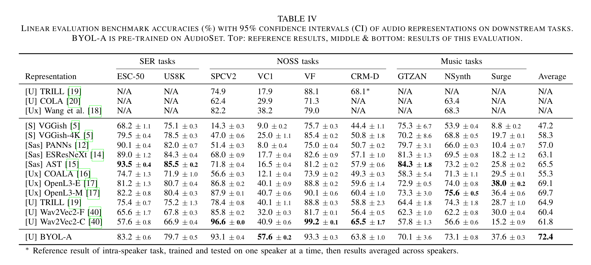
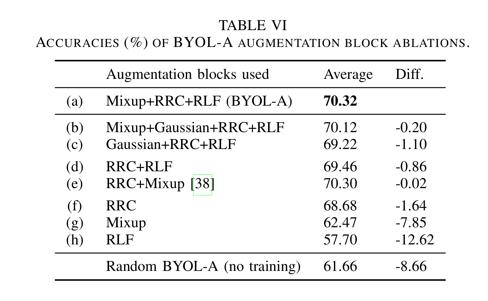
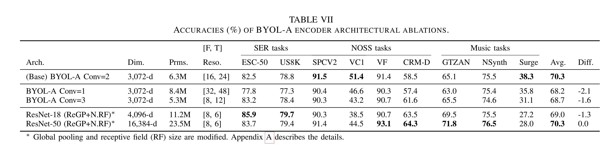
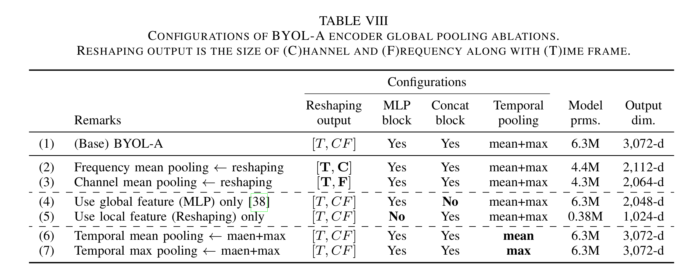
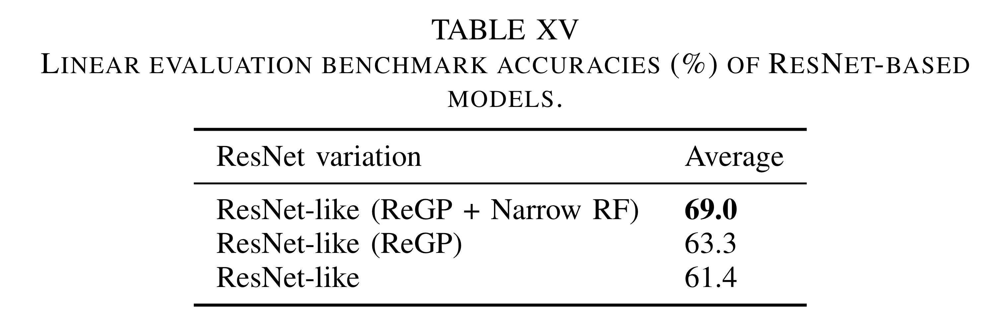

> [BYOL-A: BYOL for Audio: Exploring Pre-trained General-purpose Audio Representations](https://arxiv.org/pdf/2204.07402.pdf)  
> [BYOL-A official github](https://github.com/nttcslab/byol-a)

연관 포스트:
1. [Audio Self-supervised Learning: A Survey (1) Audio]()

BYOL-A 2번째 논문

> **Abstract**
> 1. input sound의 여러가지 측면에서 robust feature를 추출하는게  
일반적인(general) audio task를 수행할 수 있는 representation을 효과적으로 만들 수 있다는 가정에서 시작
> 2. 정보의 다양한 측면으로는 local과 global features가 있음
> 3. BYOL 논문을 바탕으로 audio data augmentations에 대해 invariant한 representation 학습 

# 1. Introduction

- audio에서 Vggish와 같은 pre-trained model을 사용해왔음
- BYOL-A에서는 다양한 task에서 작동하는 만능 audio representation 만드는 것이 목표
    - fine-tuning과 같은 단계 필요없는 representation 학습(learning rate tuning을 잘못하면 pre-trained features 해칠 수도 있음)
    - 하지만, 범용적인 표현을 위해 조금 다른 차이점이 무시될 수 밖에 없음
- 초반 layer들은 local한 특징을, 후반 layer들은 general한 특징들을 추출
    - fusing multilayer features
    - global pooling for variable-length $\rightarrow$ temporal average, max pooling, combining two
- Bootstrap Your Own Latent(BYOL) 방법 사용
    - augmentation해도 invariant한 특징 찾기
    

## 1) Contribution

- sound pertubations에 robust한 특징 찾기
- information의 다양한 측면을 제공하기 위한 local과 global features를 결합하는 encoder
- 다양한 audio task에 대한 generalizability를 평가할 수 있는 새로운 benchmark 제작
- 다른 SoTA 방법들의 11가지 benchmark의 결과와 비교
- BYOL-A framework/augmentations/encoder에 대한 ablation studies  

<em> BYOL-A framework</em>

  
 

# 2. Related Work

## 1) Relationship with our previous work

- 이전 논문에서는 unsupervised learning method와만 비교하고,  
encoder 개선점에 대해 쓰지 않음
- 이번 논문의 다른 점들
    - (1) 효과적인 general-purpose audio representation에 대한 가정 다시 설정
    - (2) BYOL-A이 특정한 소리의 representation을 학습하는 것이 아닌 data augmentation에 의해 preturbated된 소리의 invariant한 특징 학습
    - (3) data augmentation refine
    - (4) information의 다양한 측면을 결합하기 위해 encoder 구조 개선
    - (5) 통일된 benchmark을 사용하여 유명한 다른 model과 비교
    - (6) intensive ablation studies  
 

## 2) Audio pre-training methods

- pre-training methods 비교
    - Supervised learning: sample들을 predefined class에 labeling
    - Masked Prediction SSL: masking된 부분을 predict/reconstruct
    - Contrastive SSL: 큰 batch samples 안의 instance들 discriminate
    - Cross-modal SSL: cooccuurence pair modalities 학습  
     

### (1) Supervised learning

- large-scale datasets에 pre-trained
- SER task 위주

|  이름 | dataset | 기타  |
|  :---: |    :---:   | :---: |
| VGGish| YouTube-8M | - |
| PANNs (Pre-trained Audio Neural Networks, Audioset)|AudioSet| SoTA|
|PSLA ESResNe(X)t-fbsp AST(Audio Spectrogram Transformer)| ImageNet + AudioSet| SER에서 SoTA|  

 

### (2) Self-Supervised Learning(SSL)

|    task  |  models  |
|  :---:    |     :---:    |
|general | COLA |
| sound event | Fonseca et al. |
| music   | CLMR  |
| speech| TRILL, PACE+, Mockingjay, Wav2Vec 2.0, HuBERT|

- non-speech recognition(e.g. speech command recognition, speaker identification)에는 Wav2Vec을 주로 사용  
 

### (3) Cross-modal/Multi-modal

|   model  |  used-modal  |
|  :---:    |     :---:    |
|  OpenL3 | audio, visual |
| Wang et al. | video, spectrograms, raw waveforms |
| COALA | aligning the learned latent representation of audio and associated tad  sound event recognition , music task |
| SLAM | speech & language modeling jointly in a multi-task fashion|  

 

### (4) Concurrent works

|   model  |  내용  |
|  :---:    |     :---:    |
|BigSSL, data2vec, Wang et al. | remarkable performance on various task|
|SERAB| 이전 BYOL-A 적용해서 speech emotion recognition|
|data2vec|masked prediction + learning latent target representation (BYOL과 유사)|
|WavLM|masked speech prediction + denoising mixef utterance|
|**BYOL-A**|mixed backgroud sound에 대해서 invariant한 representation 학습|  

 

## 3) Benchmarks for pre-trained models

- SUPERB: speech domain task with frozen pre-trained model + lightweight heads
- HARES: linear layer head
- HEAR: shallow MLP downstream classifier
- SERAB: frozen models for various speech emotion recognition tasks  
 

## 4) Global pooling design choices

|approach|  models |
|     :---:    |     :---:    |
|flatten freq. bins + time frames + channels | VGGish, OpenL3, COALA |
|global average/max pooling| COLA, TRILL, ESResNe(X)t-fbsp|
|average freq $rightarrow$ summarize time| 아래에 추가 |

- PANNs: CNN14 model에서 frequency average $\rightarrow$ temporal pooling operation(_temporal mean+max pooling_)
- Fonseca et al.: frequency average $\rightarrow$ temporal max pooling
- Ford et al.: frequency average pooling $\rightarrow$ attention module  
 

## 5) Bootstrap Your Own Latent(BYOL)  
 

  

- image representation invariant to data augmentations
- online network: $\theta$ weight
- target network: $\xi$ weight
- online network의 prediction($\bar{q_\theta}(z_\theta)$)과 target projection($\bar{z’}_\xi$)의 L2-normalization의 mean squared error 계산

$$
L_{\theta,\ \xi} \triangleq \Vert\bar{q_\theta}(z_\theta)-\bar{z'}_\xi\Vert^2_2 =2-2\cdot\frac{\langle q_\theta(z_\theta),\ z'_\xi\rangle}{\Vert q_\theta(z_\theta)\Vert_2\cdot \Vert z'_\xi\Vert_2}
$$

- $\langle\cdot,\ \cdot \rangle$: inner product
- $L’_{\theta,\ \xi}$를 계산하기 위해서는 online과 target view $v,\ v’$를 바꿔서 넣음
- 최종 loss는 $L_{\theta,\ \xi}^{\text{BYOL}} = L_{\theta,\ \xi} + L’_{\theta,\ \xi}$
- 최종 loss는 online network의 $\theta$에 대해서만 minimize 수행
- target network weight $\xi$는 $\theta$에 대한 slowly moving exponential average, $\tau$: target decay rate

$$
\xi \leftarrow \tau\xi+(1-\tau)\theta
$$

- online network에 predictor를 추가하는 것과 target network는 online network의 moving average로 사용하는 것이  
online projection에서 더 많은 정보를 encoding하도록 하고, collapse 피하는 것 도와줌  
 

# 3. Proposed Method
## 1) BYOL for Audio (BYOL-A)
- network 구성은 위의 BYOL과 유사, image에서 audio augmentation  
 

### (1) Augmentation module-Normalization
 

  

- input raw audio sample $\rightarrow$ log-mel spectrogram
- Pre-Normalization: training sample들의 (global) mean & std
- 3가지 augmentation: Mixup, Random Resize Crop(RRC), Random Linear Fader(RLF)
- Post-Normalization: 최종 output이 $\sim N(0,\ 1)$이 되도록 만듦)  
 

### (2) Augmentation module-Augmentation
 

  

#### Mixup
- 이전 input FIFO queue에서 sample random하게 뽑아서 background sound로 바꿈
- **log-mixup-exp**: normalized log-mel spectrogram이 input이기에 linear scale로 바꾼 후 mixup 하고 다시 log scale로 바꿈

$$
\tilde{x}_i=log((1-\lambda)\ exp(x_i)+\lambda\ exp(x_k))

$$

- $x_i$: input $\qquad x_k$: mixing counterpart $\qquad \lambda$: mixing ratio $\sim U(0.0,\ \alpha) \qquad \alpha$: hyperparameter for mixing ratio
    - 실험에서 queue에 2,048 sample 저장(batch size보다 큼)  
 
    

#### Random Resize Crop (RRC)
 

  

- pitch shift / time shift / log-mel spectrogram stretch

$$
F_C=\lfloor min(U(f_1, f_2), 1.0) \times T\rfloor  \\
T_C=\lfloor U(t_1, t_2) \times T\rfloor

$$

- frequency는 frequency bin 범위 안에서 선택하고,  
time은 범위 밖으로도 crop할 수 있는데, 범위 밖은 0으로 zero padding
- crop area는 bicubic interpolation으로 원래 크기로 resize
- 논문에서는 $[f_1,\ f_2],\ [t_1,\ t_2]=[0.6,\ 1.5]$ 사용  
 

#### Random Linear Fader

- fade-in/out (volume change)
- input spectrogram: $x = x[t, f]\qquad S[t]$: temporal amplitude change

$$
S[t]=a+(b-a)\cdot t/T \quad\text{for}\quad t\in \{0,\cdots,T-1\}
$$

- $T$: number of time frames $\qquad F$: number of frequency bins
- start/end frame gain $a,\ b \sim U(-1.0,\ 1.0)$

$$
x'[t,f]=x[t,f]+S[t],  \\
\text{for} \ f \in \{0,\cdots,F-1\},  \\ 
\text{for} \ t \in \{0,\cdots,T-1\}
$$

- $a < b$: fade in $\qquad a > b$: fade out  
 

### (3) BYOL-A Encoder network

- 목표
    - (1) global pooling에서 모든 available information 보존
    - (2) 최적화 된 local features resolution
    - (3) local과 global feature 결합
    - (4) 시간 상에서의 average와 maximum statistics 결합

  

- receptive field를 작게 조절, CNN block 개수 조절(ablation+appendix A)(목표_2)
- time 축을 기준으로 frequency+channel flatten (목표_1)
- MLP가 local features를 가지고 global features 학습하고,  
local과 global features concatenate (목표_3)
- Pooling이 *temporal mean+max pooling*_을 사용하여 3,072 dimension vector로 summarize (목표_4)  
 

# 4. Experiments

## 1) Benchmark
### (1) Precedure details
- general-purpose audio representations
- standard linear evaluation protocol using **frozen pre-trained models**  
- _frozen_ pre-trained encoder를 거쳐서 sample들을 embedding으로 바꾼 후,  
task label을 가지고 linear layer 학습
- 모든 결과는 accuracy, FSD50K는 mean Average Precision(mAP), area unter the curve(AUC) 사용  
 

- 모든 audio sample들은 각 task 평균 길이에 맞춤(crop/zero-padding)
- 각 model의 default sampling rate로 resample
- embedding들은 linear layer에 들어가기 전에 standardized  
 

- linear layer 200 epoch 학습, early stopping 20 epoch
- Adam Optimizer(lr: 0.00001 $\sim$  0.01)
- 3번 학습한 결과의 평균값  
 

### (2) Downstream tasks
- 기존 연구에서 쓴 10개의 task

  

- SER: Sound Event Recognition
- NOSS: Non-semantic speech (speech command, speaker identification)
- Music: music (music genre/instrument classification)  
 

### (3) FSD50K extension
- Sound Event charateistic subsets  

  

- Single: 반복 및 연속성에 관계없이 하나의 event만 발생했을 때
- Sequential: pitch/amplitude/timbre가 sequential하게 바뀌는 sound
- Scene: 다양한 소리들의 group  
 

## 2) Pre-training BYOL-A
### (1) BYOL framework settings
- BYOL에서 쓴 MLP 똑같이 사용
    - output size: 4,096
    - BatchNorm, ReLU 사용
    - 최종 output size: 256
- Adam(lr: 0.0001), 100 epochs
- target decay rate $\tau$:0.99, batch size:256 (**7) Ablations of BYOL framework에 추가 설명**)  
 

### (2) Augmentation block parameters
- Optuna를 사용하여 exhaustive parameter search
- Mixup: $\alpha$=0.2
- Random Resize: crop boundary $[F,\ 1.5\times T]$ with range $[0.6,\ 1.5]$  
 

### (3) Dataset details
- Audioset: 1,963,807 samples, 5,455 hours
- FSD50K: 40,966 samples, 80 hours  
 

## 3) Benchmarking BYOL-A and pre-trained models
### (1) representations from previous methods

 

- S: Other audio dataset-Supervised
- Sas: Audioset-Supervised
- Ux: Cross modal-unsupervised
- U: Audio-Unsupervised  
 
- frame by frame output으로 나오는 model들은 (Wav2Vec 2.0을 제외하고) _temporal mean+max pooling_ 사용  
  

### (2) Results and discussions

 

- ESC-50, Us8K, GTZAN
    - Audioset-Supervised\[Sas]와 gap 존재
    - Audioset에 비슷한 labels 존재  
     
- SPCV2, VoxForge, CREMA-D
    - Wav2Vec2-C가 가장 좋은 결과 (speech에 대한 pre-trained됨)
    - BYOL-A는 다른 방법들과 유사한 결과  
     
- Unsupervised model은 여러 task에 잘 작동됨 $\rightarrow$ general한 representation
- TRILL, Wav2Vec2는 speech에 대해서만 pre-trained했기에 speech 관련 task가 아니면 성능이 떨어짐
- OpenL3-M(music), OpenL3-E(environment sound)는 하나의 domain에서 pre-train했지만, 다른 task에 대해서도 성능 좋음  
 

 

- **table 4.** representation에 대한 Pearson correlation coefficient
- supervised는 supervied끼리, unsupervised는 unsupervised끼리 correlation이 큼  
$\rightarrow$ label supervision이 task 성능에 영향줌
    > **(원문)** the correlations are high among the supervised learning methods and among the unsupervised learning methods,  
    indicating that the label supervision tends to affect the task performance trend  
- ESResNeXt, AST는 image와 audio dataset 사용 $\rightarrow$ 구조보다 (CNN vs Transformer) dataset과 learning method가 더 큰 영향을 줌
- COALA와 supervised trend가 유사  
$\rightarrow$ tag와 audio에 대한 cross modal training은 label에 대한 supervision과 유사  
 

### (3) Results on the FSD50K

 

- Single source event에 대해 성능이 좋아야, general audio task에 좋은 결과를 냄  
 

## 4) Ablations of audio augmentation blocks
### (1) Experimental settings
- Mixup, RRC, RLF, **Gaussian** $\sim N(0, 0.4)$  
 

### (2) Reults and discussions

 

- (f)~(g): RRC가 가장 영향이 큼
- (h): weak augmentation은 쓸만한 representation 손상시킬 수 있음
- (d), (f): RRC도 다른 block과 결합하면 더 좋음
- (a), (e): 이전 version과 비교  
 
- (a), (b), (c): Mixup이 Gaussian보다 효과적
- random noise를 섞는 것은 성능 악화시킴  
 
 
## 5) Ablations of encoder network architecture
### (1) Convolutional block ablations

 

- Conv = 1
    - rich resolution
    - single convolution은 특징 추출하기에는 부족함
- Conv = 3
    - lower resolution
    - VC1(speaker classification), Surge(pitch classification)에서 성능 떨어짐  
    $\rightarrow$ frequency-wise information이 중요한 task에는 resolution이 어느정도 보장되어야함  
  

### (2) Replacing network with ResNets
- ResNet-50과는 비슷하지만, ResNet-18보다 좋음
- VC1(speaker classification), Surge(pitch classification)에서 성능 떨어짐  
$\rightarrow$ frequency-wise information이 중요한 task에는 resolution이 어느정도 보장되어야함(Conv = 3와 동일)  
$\rightarrow$ frequency stride를 작게하는 방법도 있지만, output feature dimension이 너무 커짐
- embedding network로 ResNet을 수정하거나 Transformer를 쓰는 방법을 연구가 추가적으로 진행되어도 좋을 것 같다는 결론  
 

## 6) Ablations of encoder global pooling blocks

 

- **Reshaping Ablation (2), (3)**
    - (2) frequency average, (3) shannel average $\Rightarrow$ 전체적으로 성능 감소
    - (2): 특히 frequency가 중요한 VC1, Surge에서 크게 하락  
     

- **Local and Global features (4), (5)**
    - Surge 제외하고 golbal만 쓰는게 local만 쓰는 것보다 accuracy 높음
    - MLP가 network capacity가 가장 크지만, 의미있는 정보 추출
    - (1)과 비교하면, 둘 다 concat해서 쓰는게 가장 좋았음  
     

- **Temporal Pooling Ablation (6), (7)**
    - (6) mean, (7) max
    - max pooling이 general representation에 좋음
    - (1)과 비교하면, 둘 다 쓰면 몇 task에 accuracy가 떨어지지만, 평균적으로는 더 나아짐  
     

 

- **MLP 크기 Ablation**
    - 2,048 dimension 이후로는 saturation  
 

## 7) Ablations of BYOL framework
**<Target Decay Rate $\tau$>**

 

- BYOL보다 target decay rate $\tau$에 robust  
- $tau$가 0 혹은 1일 때와 비교하면, moving average target 없이도, random initalized target으로도 학습이 잘 됨
- BYOL framework의 bootstrapping behavior에 크게 의존하지 않음  
  

**<Prediction Layer $q_\theta(z_\theta)$>**

 
 

**\<Batch Size>**

 
 

## 8) Summary of experiments

 
 

# Appendix A
- **Making an Image-CNN-Based Model Perform on General Audio Task Benchmark**
- ResNet-like: ResNet-18에서 input channel이 3 $\rightarrow$ 1, FC layer 제거  
global average pooling으로 output dim을 512로 만듦
- ReGP(Replace Global Pooling)
    - Global Pooling 대신에 BYOL-A encoder의 Reshaping+Pooling block 시용  
    $\Rightarrow$ embedding size 1,024 dim
- Narrow RF: stride [2, 2, 2, 2, 2] $\Rightarrow$ [1, 2, 2, 2, [1, 2]]  
[1, 2]: frequency stride를 1로 바꿈 $\Rightarrow$ output shape [2, 3] $\rightarrow$ [8, 6]  
$\Rightarrow$ embedding size 2,048 dim

<em> BYOL-A 70.3%</em>

 
 
