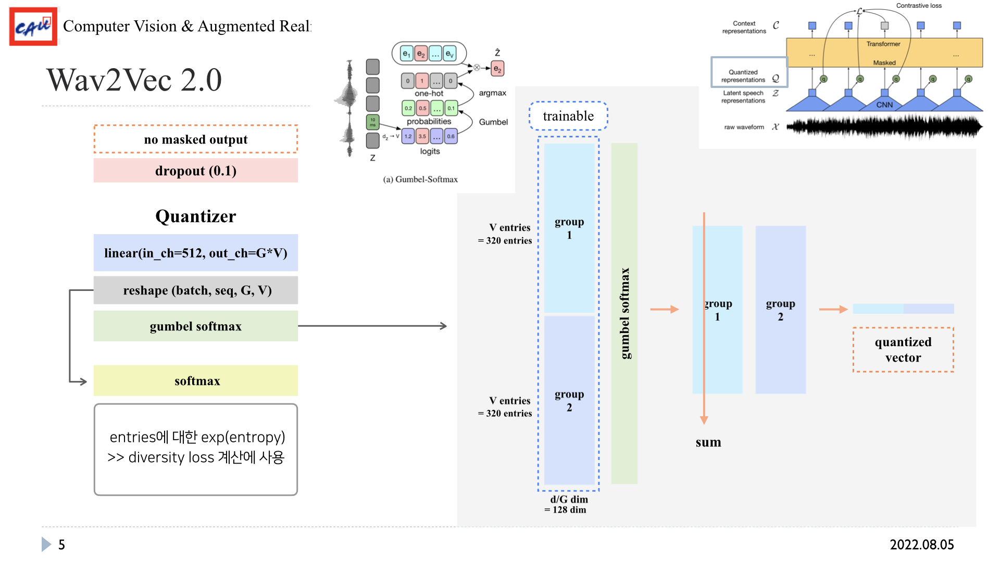

논문: [wav2vec 2.0: A Framework for Self-Supervised Learning of Speech Representations](https://arxiv.org/pdf/2006.11477.pdf)  
연관 포스트: 
1. [Learning Filterbanks From Raw Speech For Phone Recognition]()
2. [Audio Self-supervised Learning: A Survey (2) Audio ]()  

> **Abstract**
> 1. latent space fraure들을 masking하고 quantized latent representations과 contrastive task로 학습시킴
> 2. label data를 1시간으로 줄여도 이전의 SOTA보다 성능이 좋음

# 1. Network 전체 구조

<em> 논문에 있는 network 구조</em>

 

모델의 구조는 
1. Feature encoder
2. Contextualized representation with Transformers
3. Quantization module
4. Loss 

  

더 세분화하면 총 5가지 module로 나눌 수 있음
1. Feature extractor (1. Feature encoder)
2. Feature projector (1. Feature encoder)
3. Contextualizater (2. Contextualized representation with Transformers)
4. Quantizator (3. Quantization module)
5. Loss (4. Loss)

# 2. Feature encoder & Contextualized representation

  

- 세부적인 parameter 값들은 변경될 수 있으나, 위 값들은 HuggingFace facebook/wav2vec2-base를 기준으로 작성되었음
- raw waveform을 각 data의 mean&variance 값으로 normalize한 후, convolution으로 이루어진 extractor에 넣어줌  
convolution으로 spectrogram을 만드는 것이라고 생각하면 됨 (연관 포스트 1.)
- extractor에서 나온 값은 projector에 들어가는데, 이때 layer_normalization한 후 값들은 각각 다른 연산 수행
    - no_masked_output으로 quantization에 사용되는 값
    - 나머지 layer들을 거치면서 contextual representation이 되는 값
- 나머지 layer를 거친 후, masking 처리(0이 아닌 학습되는 행렬값으로 masking)  
전체 길이의 일부분을 masking length만큼 masking하는데, 겹쳐도 상관 없음
- positional encoding을 해준 값과 더함
- transformer를 거쳐서 contextual representation으로 만들어줌  
 

# 3. Quantization module

  

- Quantization module은 [VQ-wav2vec](https://arxiv.org/pdf/1910.05453.pdf)에서 나온 아이디어
- 음성을 continuous에서 discrete한 representation으로 바꿔줌
- 고정된 크기의 codebook 안에 있는 entriese들을 뽑아서 discrete vector를 표현함  
- argmax는 미분이 불가능하기 때문에 gumbel-softmax 사용 (pytorch에 구현되어 있음)
 

- projector에서 masking하지 않은 값(layer normalization 직후 값)을 codebook의 G group * V entries dimension으로 linear projection 해줌
- 위 값들을 gumbel-softmax에 넘겨주면, 어떤 group의 어떤 entries인지에 대한 확률이 나오게 됨
- 이 확률 값과 codebook 값과 곱해주면 codebook에서 entries를 뽑는 것과 같은 결과
- 각 group의 entries axis로 더해주어 quantizated representation이 나오게 됨
- 위 quantization vector은 encoding된 sequence의 길이만큼 나오게 됨  
 

- gumbel-softmax가 아닌 softmax를 취해준 값을 이용해서 entries에 대한 entropy를 계산하여 Divesrsity Loss에 사용  
- gumbel-softmax에는 temperature $\tau$ 가 있음  
0에 가까워질수록 one-hot으로 변환되어 categorical distribution이 되고, 커질수록 uniform distribution이 됨  
[CATEGORICAL REPARAMETERIZATION WITH GUMBEL-SOFTMAX](https://arxiv.org/pdf/1611.01144.pdf)
- 처음에는 2로 학습하지만 학습하면서 0.5까지 값을 줄임
 

# 4. Loss

  

- **Contrastive Loss**
    - masking한 부분의 frame에서 random N개 sampling $\rightarrow$ negative-sample $\tilde{q}$
    - 자신은 positive sample $q_t$
    - 총 (N+1)개의 contextual vector와 해당 frame의 quantized vector의 cosine similarity 계산
    - positive sample과의 cosine similarity가 최종 target 값
    - cross-entropy function으로 계산  
    - contrastive loss의 $\kappa$ 는 0.1
     

- **Diversity Loss**
    - codebook의 entries를 편중되지 않게 사용했는지 확인하는 loss
    - 비중을 줄이기 위해 0.1을 곱해줌

