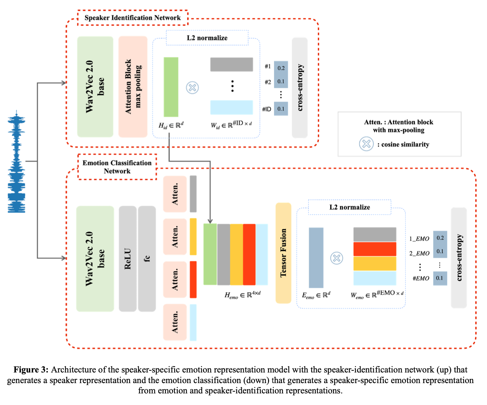
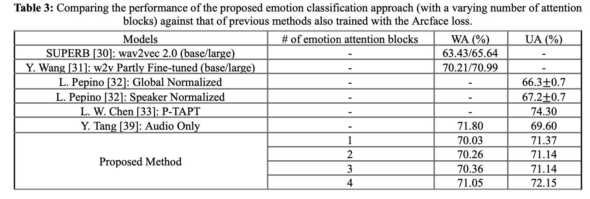
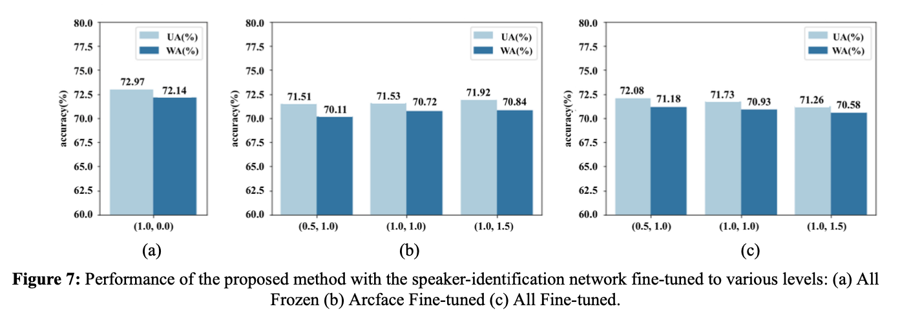
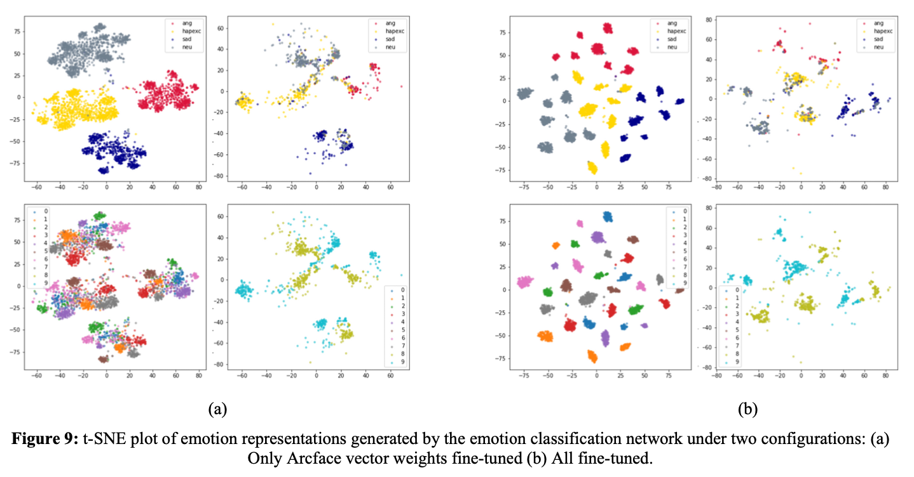
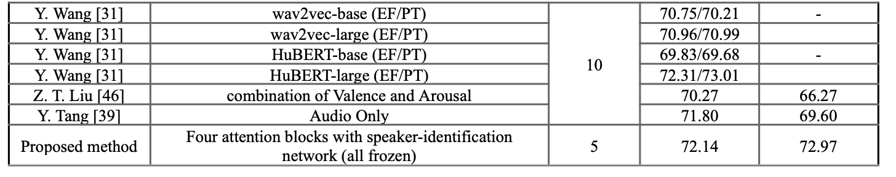
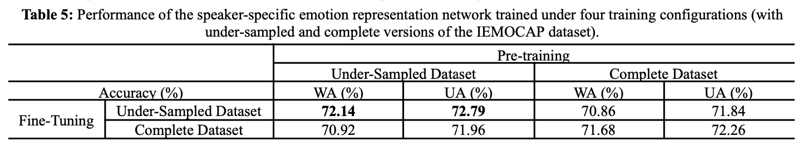

> <b>Abstact</b> 
음성 감정 인식(speech emotion recognition, SER)은 사람이 컴퓨터 및 주변 기기와 자연스럽고 편하게 상호작용을 위해 필요한 기술이다. 하지만 발화자에만 한정된 목소리 특성은 감정 분류할 때 방해될 수도 있다. 본 논문은 발화자 특징을 고려하여 SER 성능을 향상시키고자 하였다. 두 개의 wav2vec 2.0 기반의 모듈(a speaker-identification network and an emotion classification network)을 Arcface loss를 사용하여 사전 학습시켰다. 사전 학습된 각 모둘의 특징값들을 결합하고 미세조정(fine-tuning)하여 speaker-specific한 정보를 담은 emotion 특징값을 생성한다. Interactive Emotional Dynamic Motion Capture (IEMOCAP) 데이터셋에 대해 weighted accuracy (WA)는 72.14% 그리고 unweighted accuracy (UA)는 72.97% 정확도를 보였다. 

# Contribution
- SER(음성 감정 인식, speech emotion recognition)의 성능을 향상시키기 위해 발화자를 고려한 방식 제안
- wav2vec 2.0을 기반 2개의 모듈(a speaker-identification network and an emotion classification network)에 음성 파형을 입력값으로 넣어주어 각각 speaker와 emotion에 대한 특징값 추출
- 위 2개의 특징값을 새로운 tensor fusion 방식으로 혼합하여 speaker-specific emotion representation 생성
- 10명의 speaker로 구성된 IEMOCAP 데이터셋을 활용하여 speaker에 대한 정보를 인코딩할 때 과적합(overfitting)될 가능성이 높음 이를 방지하고 발화자에 대한 일반화 성능을 향상하기 위해 VoxCeleb1 데이터셋 사용
- Arcface 손실함수를 사용하여 네트워크 학습

# Methodology
- speaker-identification network, emotion classification network: wav2vec 2.0 기반 네트워크 + Arcface 손실함수
- speaker representation + emotion representation $- \text{ tensor fusion}\rightarrow$ speaker-specific emotion representation

 

 

 

# Result

 

 

 

 

 

 

 

 

# Ablation Study

 

 

 

 

