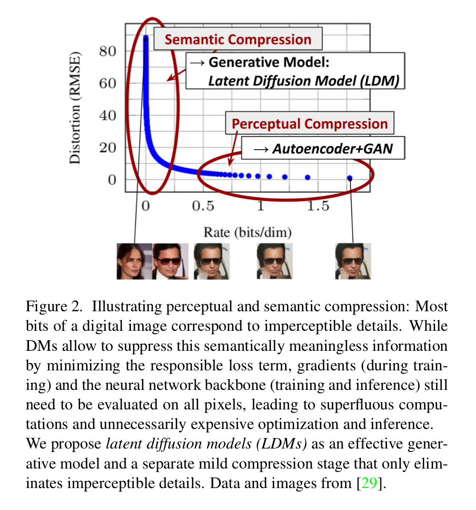

> 논문: [High-Resolution Image Synthesis with Latent Diffusion Models](https://openaccess.thecvf.com/content/CVPR2022/papers/Rombach_High-Resolution_Image_Synthesis_With_Latent_Diffusion_Models_CVPR_2022_paper.pdf)

# Abstract
- 기존 diffusion model들은 input image 크기를 유지하기에 연산량이 많은 문제가 존재 (pixel space) 
$\rightarrow$ 이를 해결하기 위해 pretrained autoencoder의 latent space에서 diffusion 진행
- cross-attention layer를 사용  
$\rightarrow$ text나 bounding boxes와 같은 conditional generator로 사용 가능& convolution 방식으로 고해상도 이미지 생성 가능

# 1. Introduction
- likelihood-based model 장점 
1\) mode-collapse 없음 
2\) GANs보다 안정적인 학습 
3\) parameter sharing으로 Autoregressive(AR) model처럼 수 십억 parameter들이 필요 없음

- likelihood-based model 단점 
1\) data의 미세한(imperceptible) 묘사를 위해 과도한 양의 용량(컴퓨팅 리소스)을 소비 
2\) 학습 및 sampling 시에 많은 연산과 시간 필요
  

-  본 논문에서 latent space를 사용하게 된 이유
    

        
    

    - pixel space에서 학습한 diffusion model의 rate-distortion trade-off 
        rate가 1.5 이상 ~ 0.5까지에서의 이미지의 차이를 사람이 잘 느끼지 못 함 
        즉, digital image의 대부분의 bits가 인지할 수 없는(imperceptible) details를 나타냄을 의미함
    
    - likelihood-base model들은 애략 2개의 stage로 나눠질 수 있음 
        1\) Perceptual (인지적인) compression stage: high-frequency detail은 지우지만, 작은 의미적인(semantical) 변화 학습 
        2\) Semantic (의미적인) compression stage: 실제 generative model이 데이터의 sematic & conceptual 요소 학습
            
    - 제안된 논문의 목표는 고해상도 이미지 생성을 위한 diffusion model를 학습시킬,  인지적인 차이는 없지만 (perceptually equivalent)연산적으로 더 적합한 space를 찾는 것

- 제안된 Latent Diffusion Models
    - 먼저 auto-encoder 학습하여, data space에서 인지적으로는 동일하지만 더 작은 차원으로 효율적인 representational space를 찾음 
    diffusion model이 latent space에서 학습되므로, 공간적 차원과 관련하여 더 나은 scaling 특징을 나타냄  
    그렇기에 이전 방식과 다르게, 과도한 공간적 압축(spatial compression)에 의존하지 않아도 됨 
    또한, 한 개의 network pass만으로도 latent space에서 효율적인 이미지 생성이 가능해짐

    - $\Rightarrow$ **Latent Diffusion Models (LDMs)**
    
    - 제안된 방법의 장점 
        보편적인 autoencoding stage를 단 한 번만 학습 가능해서, 다양한 diffusion model 학습에 재활용하거나 완전히 다른 task에 사용할 수 있음 

        $\Rightarrow$ diffusion model의 UNet에 transformer를 연결하는 구조 제안하여, 임의의 종류에 대한 token-based conditioning 방법이 가능하게 함

## Contributions
1. 이전의 순수한 transformer-based 방법과 달리, 더 높은 차원 데이터에 대해 확장이 용의 
    a\) 더 충실하고 상세한 reconstruction이 가능하게 하는 압축된 level에서 작업 가능 
    b\) 고해상도인 megapixel 이미지 생성에 효울적으로 적용 가능 

2. 다양한 task와 dataset에 대해 경쟁력 있는 성능을 보여주며, 연산량을 확연하게 낮춤 
    a\) unconditional image synthesis, inpainting, stochastic super-resolution 
    b\) pixel-based diffusion에 비해 inference cost도 확연하게 감소됨

3. reconstruction과 생성 능력을 위한 섬세한 weighting이 필요하지 않음 
    a\) 그 이유는 encoder/decoder 구조와 score-based prior를 동시에 학습하지 않아도 되기 때문
    b\) 굉장히 충실한 reconstruction을 보증하고, latent space에 대한 regularization이 매우 적게 요구 됨

4. convolutional 방식에 대해 적용될 수 있고, 더 크고 안정된 이미지 생성 가능 
    a\)super-resolution, inpainting, semantic synthesis과 같은 조밀한 conditioned task들에 적용 가능 
    b\) $~ 1024^2$ px 까지 확장 가능

5. cross-attention에 기반으로 일반화된 목적을 위한 conditioning 방법을 디자인하여, multi-modal 학습 가능 
    class-conditional, text-to-image, layout-to-image

6. released pretrained latent diffusion and autoencoding models 
    https://github.com/CompVis/latent-diffusion 
    
# 2. Related Work
## Generative Models for Image Synthesis

## Diffusion Probabilistic Models

## Two-Stage Image Synthesis